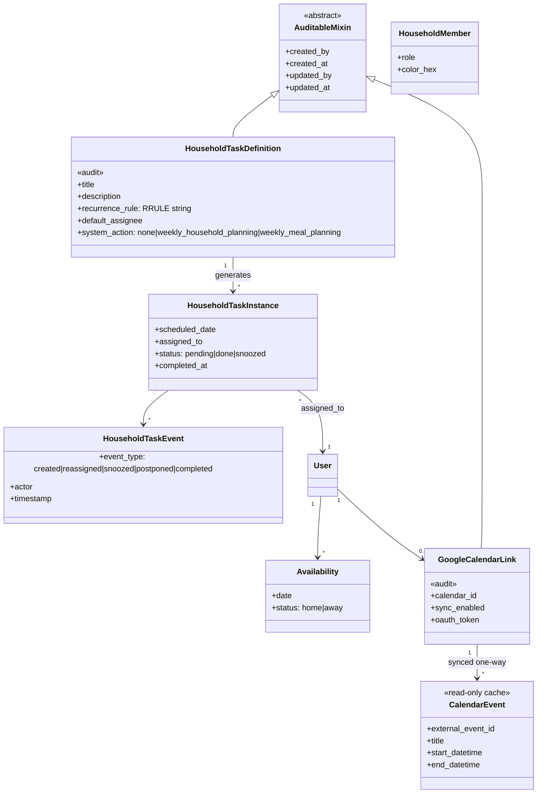
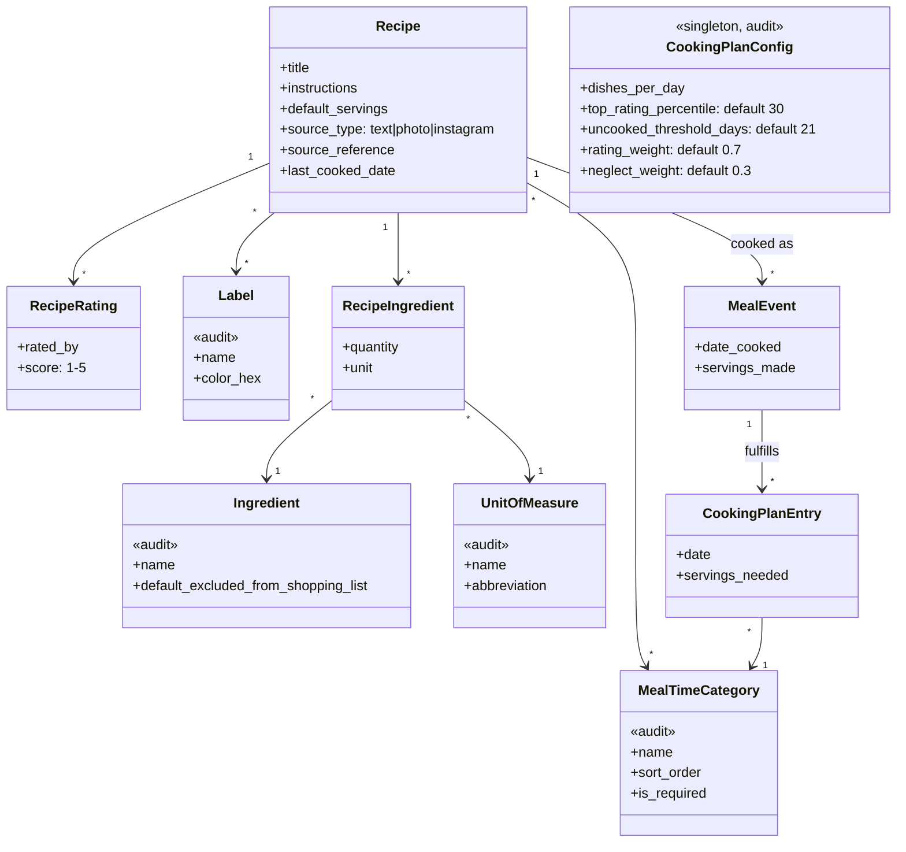
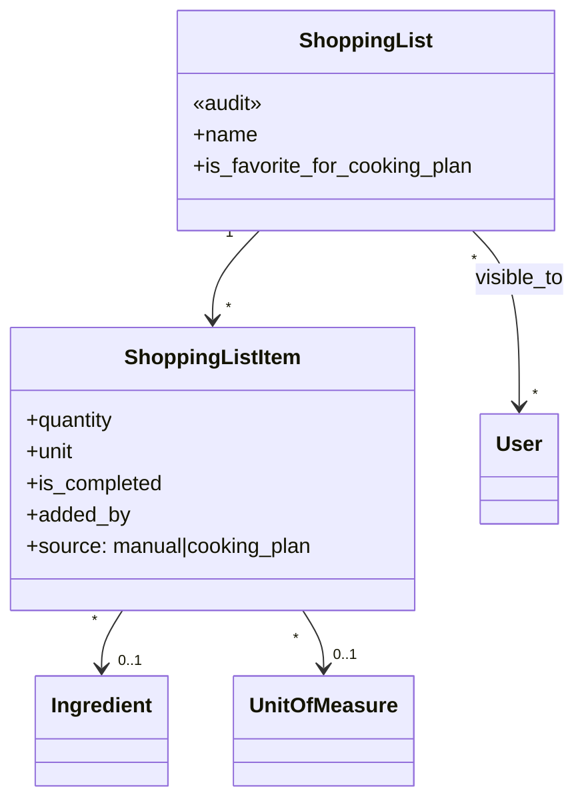
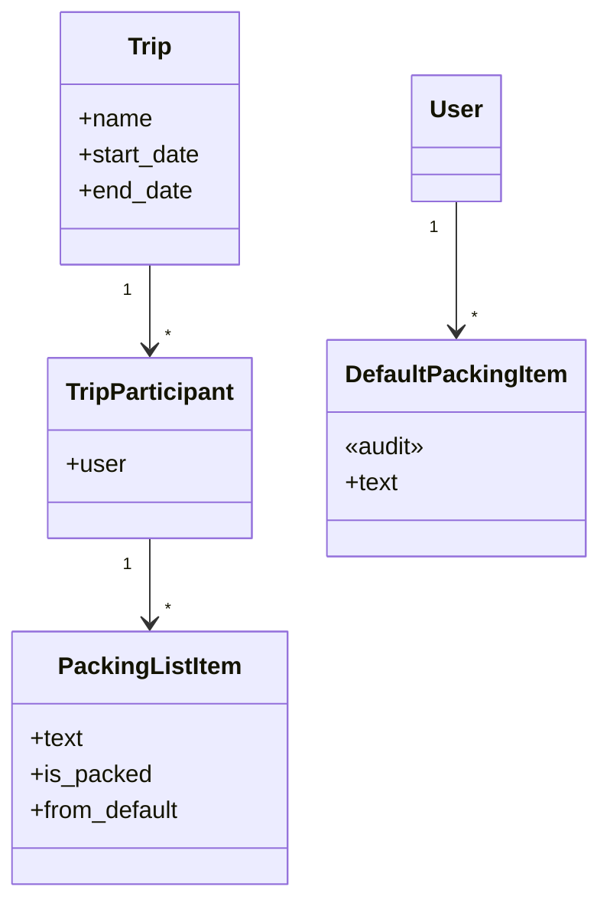
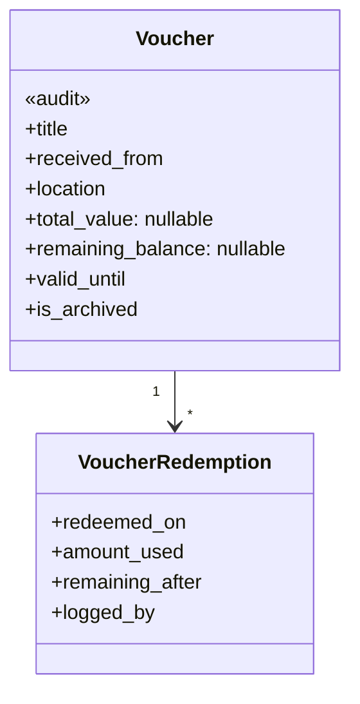
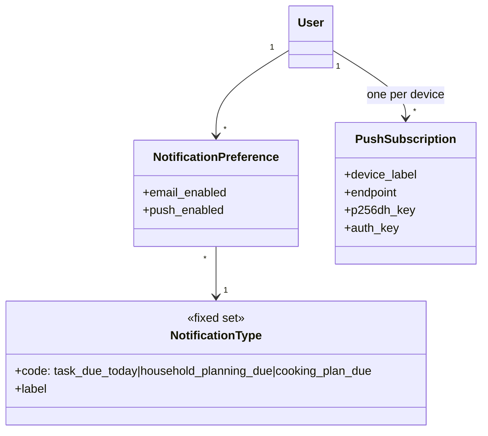

# Feature Plan

Domain model for the next phase of Husehold, covering household planning, cooking plan, shopping, recipes, packing lists, vouchers, and supporting features (config, analytics, notifications). See [CLAUDE.md](CLAUDE.md) *(gitignored, local only)* for day-to-day dev/deploy context, and [README.md](README.md)/[DEPLOYMENT.md](DEPLOYMENT.md) for setup.

Current state: this is a target model, not a migration plan. The existing `backend/household/models.py` (flat `ShoppingListItem`, `Recipe`, `CookingPlan`, `HouseholdTask`) will be substantially restructured to reach this — see [Suggested build order](#4-suggested-build-order) for how that's phased.

## 0. Decisions

- **Config**: editable by both household members, no admin gating. Every config-editable record tracks who created/last-updated it and when, via a shared `AuditableMixin` rather than repeating fields per table.
- **Recipe import (photo/Instagram)**: deferred to the last build phase, alongside notifications and calendar sync.
- **Notifications**: both email and phone push (via the home-screen web app), grouped into clustered types (task due today, weekly household planning due, weekly cooking plan due, ...), each independently toggleable per channel per user.
- **Google Calendar**: one-way only, shown as a read-only overlay in the weekly planning view so you can see who's traveling/busy while assigning tasks and meals.
- **Recipe recommendation lists**: three ranked, mutually-exclusive buckets per meal-time category — *Craving for it* (combined rating+neglect score) > *Top 30% rated* > *Not cooked in 21+ days* > everything else. 1–5 star ratings per member, average shown. Free-form **labels** (e.g. "Tim's Favorite", "10min Fast Track") that members define and assign, searchable as a tab in the Cooking Plan.
- **Recurrence**: full Outlook-style flexibility, including "first Monday of the month" — solved by storing a standard [RFC 5545 RRULE](https://www.rfc-editor.org/rfc/rfc5545) string rather than hand-rolling recurrence fields (Python's `dateutil.rrule` already implements the whole spec).
- **Role enforcement**: confirmed still equal permissions everywhere, including all config.
- **UX**: color-coded task cards by assignee (color configurable per member) in a drag-and-drop weekly view — first-class requirement of Phase 1, not later polish.
- **Visual styling**: out of scope for this planning pass. The diagrams above cover data/behavior only — layout, typography, and overall design system for the new screens will be discussed separately once a phase is ready to build.

## 1. Use Case Diagram

```mermaid
graph TD
  Member(["Household Member"])
  Admin(["Admin"])

  subgraph Home["Home Dashboard"]
    UC_home[View overdue tasks, progress,<br/>today's meals, today's tasks]
  end

  subgraph Plan["Household Plan"]
    UC_p1[Weekly view: color-coded,<br/>drag-and-drop tasks onto days]
    UC_p2[Reassign a task]
    UC_p3[Snooze a task]
    UC_p4[Postpone a task]
    UC_p5[Set own availability]
    UC_p6[View Google Calendar overlay<br/>-- who's away when]
    UC_p7[Configure task recurrence -- RRULE]
    UC_p8[Configure member colors]
  end

  subgraph Cook["Cooking Plan"]
    UC_c1[Weekly meal planning session]
    UC_c2[Browse Craving / Top-rated /<br/>Not-cooked-recently / All]
    UC_c3[Search recipes by label]
    UC_c4[Send planned meal to shopping list]
    UC_c5[Mark one dish as covering multiple meals]
  end

  subgraph Shop["Shopping"]
    UC_s1[Maintain multiple shopping lists]
    UC_s2[Check off item -- removed for everyone]
    UC_s3[Mark a list as favorite]
  end

  subgraph Rec["Recipes"]
    UC_r1[Add recipe via text]
    UC_r2[["Add recipe via cookbook photo"]]
    UC_r3[["Add recipe via Instagram video"]]
    UC_r4[Rate a recipe 1-5 stars]
    UC_r5[Create + assign labels]
  end

  subgraph Trip["Packing Lists"]
    UC_t1[Create a trip, add participants]
    UC_t2[Maintain per-user default items]
    UC_t3[Check off packed items per person]
    UC_t4[Browse past trips]
  end

  subgraph Vouch["Vouchers"]
    UC_v1[Add a voucher -- from whom,<br/>value, where valid, expiry]
    UC_v2[Log a partial redemption --<br/>records remaining balance]
    UC_v3[Browse active vouchers,<br/>sorted by soonest-expiring]
    UC_v4[View archived -- fully used --<br/>vouchers, grayed out]
  end

  subgraph Analytics["Analytics"]
    UC_an1[View household stats --<br/>tasks, meals, spending over time]
  end

  subgraph Admin_Sec["Admin only"]
    UC_a1[Manage user accounts]
    UC_a2[Database access]
  end

  subgraph Config["Config -- open to all members"]
    UC_cfg1[Configure recurring tasks]
    UC_cfg2[Configure meal-time categories]
    UC_cfg3[Configure shopping lists + visibility]
    UC_cfg4[Configure excluded ingredients + units]
    UC_cfg5[Configure notification preferences]
    UC_cfg6[["Connect Google Calendar"]]
  end

  subgraph Notif["Notifications"]
    UC_n1[Receive clustered email/push digests]
    UC_n2[Toggle each notification type<br/>per channel]
  end

  Member --> UC_home
  Member --> UC_p1
  Member --> UC_p2
  Member --> UC_p3
  Member --> UC_p4
  Member --> UC_p5
  Member --> UC_p6
  Member --> UC_p7
  Member --> UC_p8
  Member --> UC_c1
  Member --> UC_c2
  Member --> UC_c3
  Member --> UC_c4
  Member --> UC_c5
  Member --> UC_s1
  Member --> UC_s2
  Member --> UC_s3
  Member --> UC_r1
  Member --> UC_r2
  Member --> UC_r3
  Member --> UC_r4
  Member --> UC_r5
  Member --> UC_t1
  Member --> UC_t2
  Member --> UC_t3
  Member --> UC_t4
  Member --> UC_v1
  Member --> UC_v2
  Member --> UC_v3
  Member --> UC_v4
  Member --> UC_an1
  Member --> UC_cfg1
  Member --> UC_cfg2
  Member --> UC_cfg3
  Member --> UC_cfg4
  Member --> UC_cfg5
  Member --> UC_cfg6
  Member --> UC_n1
  Member --> UC_n2
  Admin --> UC_a1
  Admin --> UC_a2

  classDef future stroke-dasharray: 4 3
  class UC_r2,UC_r3,UC_cfg6 future
```

Dashed = deferred to the last build phase (recipe photo/Instagram import, Google Calendar connect).

## 2a. Household Plan & Tasks

*(Haushaltsplan)*

All config-editable entities (marked `«audit»`) share one abstract base carrying `created_by`, `created_at`, `updated_by`, `updated_at`. Recurrence is a single RRULE string per `HouseholdTaskDefinition`, parsed with `dateutil.rrule` — this is what buys "first Monday of the month" for free instead of hand-rolled interval/weekday fields.

| Decision | Modeled as |
|---|---|
| Color-coded weekly view | `HouseholdMember.color_hex`, set in Config; the weekly drag-and-drop UI colors each `HouseholdTaskInstance` card by `assigned_to`'s color. |
| Outlook-style recurrence | `HouseholdTaskDefinition.recurrence_rule` stores an RFC 5545 RRULE string (e.g. `FREQ=MONTHLY;BYDAY=1MO` for "first Monday of the month"); `dateutil.rrule.rrulestr()` expands it into dates. |
| Calendar overlay | `CalendarEvent` is a read-only, periodically-synced mirror of the linked Google Calendar, rendered alongside `HouseholdTaskInstance`/`CookingPlanEntry` in the same weekly view — informational only, never written back to Google. |
| Audit trail on config | `AuditableMixin` inherited by every config-editable model across all domains (see 2b/2c/2e/2f too). |

## 2b. Meal Planning & Recipes

*(Kochplan · Rezepte)*

The three recommendation buckets are a ranking query, not stored fields — computed per `MealTimeCategory` so "top 30% for dinner" and "top 30% for dessert" are independent.

| Decision | Modeled as |
|---|---|
| Craving / Top 30% / Not-cooked-21+ / Rest | Ranking query per `MealTimeCategory`, evaluated top-down and mutually exclusive: **1)** Craving = highest combined score of (rating percentile × `rating_weight` + neglect percentile × `neglect_weight`), weighted toward rating since the recipe list is expected to already skew toward liked dishes, **2)** remaining recipes in top `top_rating_percentile`% by average `RecipeRating.score`, **3)** remaining recipes with `last_cooked_date` older than `uncooked_threshold_days`, **4)** everything else. Thresholds and weights live on `CookingPlanConfig` so they're tunable. |
| 1–5 star ratings, average shown | `RecipeRating` one row per (`recipe`, `rated_by`); UI shows each member's score plus the average. |
| Labels, member-defined, searchable tab | `Label` (audited) with a plain M2M to `Recipe`; Cooking Plan gets a "browse by label" tab alongside the four ranked buckets. |
| Photo / Instagram import | `Recipe.source_type`/`source_reference` fields reserved now, extraction pipeline deferred (see Phase 9). |

## 2c. Shopping

*(Einkaufsplan)*

Unchanged from the earlier draft other than inheriting `AuditableMixin` on `ShoppingList`, since it's config-managed (visibility, favorite flag).

## 2d. Packing Lists

*(Urlaubspacklisten)*

Fully independent of every other domain — safe to build in any order.

## 2e. Vouchers

*(Gutscheine)*

A standalone tracker, unrelated to shopping/cooking — mainly for gifts from friends/family: store vouchers, but also non-monetary presents like a dinner invitation that have no numeric value. Vouchers get redeemed partially over time rather than in one go, so each redemption is logged rather than just decrementing a number — the remaining balance has a history instead of only a current snapshot.

| Decision | Modeled as |
|---|---|
| Title | `Voucher.title` — short free-text label (e.g. "Christmas voucher from Mom", "Dinner at Lisa & Jan's"), shown as the card heading. |
| From whom | `Voucher.received_from` — free text, since gifters aren't household members with accounts. |
| Location it's valid for | `Voucher.location` — store/restaurant/site the voucher can be redeemed at. |
| Value can be blank | `Voucher.total_value`/`remaining_balance` are nullable — a monetary store voucher has a value, but a non-monetary gift (e.g. a dinner invitation) just leaves both blank and tracks title/from/location/expiry only. |
| Partial use tracked over time | `VoucherRedemption` logs each redemption (`amount_used`) with a `remaining_after` snapshot; `Voucher.remaining_balance` is kept in sync as the current total, so the UI doesn't need to replay the log to show a balance. Only meaningful when `total_value` is set — a valueless gift just gets marked used/archived directly. |
| List sorted by validity | Active vouchers list sorted by `valid_until` ascending — soonest-expiring first. |
| Fully used vouchers archived | Once `remaining_balance` reaches 0, `Voucher.is_archived` is set (automatically, on the redemption that empties it) and the card renders grayed-out in an "Archive" section instead of the active list. |

Fully independent of every other domain — safe to build in any order, same as Packing Lists.

## 2f. Config, Analytics & Notifications

*(Support Features)*

| Decision | Modeled as |
|---|---|
| Clustered notification types | `NotificationType` is a small fixed set (task due today, household planning due, cooking plan due, ...) rather than one generic on/off switch. |
| Per-type, per-channel toggle | `NotificationPreference(user, notification_type)` carries independent `email_enabled` / `push_enabled` booleans. |
| Push to phone from the home-screen web app | Standard Web Push API: each installed instance (iPhone, Android) registers a `PushSubscription` with its own endpoint/keys. **Constraint:** Web Push requires a secure context (HTTPS) — the Pi currently serves plain HTTP, so this needs a TLS cert in front of Nginx before push can work at all. |
| Email | Plain SMTP send, triggered by the same scheduled job that checks push. |
| Delivery scheduling | Needs a periodic job on the Pi — a cron-triggered Django management command is the simplest fit for a Pi 3, no need for a full Celery+broker setup at this volume. |

Analytics is unchanged — still pure queries, no new tables — but the new audit fields add a free extra: a "who changed this config item and when" history view becomes possible everywhere `AuditableMixin` is used.

## 3. Cross-domain dependencies

| From | To | Nature |
|---|---|---|
| Cooking Plan | Household Plan | Weekly meal planning is a `HouseholdTaskDefinition` occurrence. |
| Cooking Plan | Recipes | Needs structured ingredients + ratings + labels to power the four recommendation buckets. |
| Cooking Plan | Shopping | Writes into the favorite (or chosen) `ShoppingList`. |
| Household Plan | Google Calendar | One-way `CalendarEvent` overlay in the weekly view — read-only, no write-back. |
| Notifications | Household Plan, Cooking Plan | Reads due `HouseholdTaskInstance`/`CookingPlanEntry` rows; needs the scheduler + HTTPS decisions below regardless of trigger source. |
| Everything config-editable | AuditableMixin | Shared base, touches almost every model — worth introducing in Phase 1 rather than retrofitting later. |
| Analytics | Everything, including Vouchers | Read-only, build last. |
| Packing Lists | (none) | Fully independent. |
| Vouchers | (none) | Fully independent. |

## 4. Suggested build order

See [PHASE1_PLAN.md](PHASE1_PLAN.md) for the concrete implementation plan for step 1 (Task engine core — already shipped and deployed).

0. **Vouchers** *(shipped)* — `Voucher`/`VoucherRedemption`, redemption slider, expiring-soon indicator (6-month lookahead, also surfaced as a count in the dashboard overview panel), inline editing (value locked once a redemption is logged), manual archive/unarchive.
1. **Task engine core** *(shipped)* — `AuditableMixin` introduced here (used everywhere after), `HouseholdTaskDefinition` with RRULE recurrence, `HouseholdTaskInstance`/`HouseholdTaskEvent`, reassignment/snooze/postpone, color-coded drag-and-drop weekly view, `HouseholdMember.color_hex`.
2. **Recipes with structure** *(built, not yet deployed)* — `Ingredient` (free-text entry, auto-created case-insensitively), `UnitOfMeasure` (plain labels, no conversion), `RecipeIngredient`, `RecipeRating` (1-5 per member, both scores + average shown), `Label` (seeded starter set, editable), `MealTimeCategory` (Frühstück/Mittagessen/Abendessen/Dessert & Snacks) -- labels, meal types and units are bilingual (`name_de` required, `name_en` optional, UI falls back to German; ingredients stay single-language free text), servings scaling with fraction rounding, pasted-ingredient-list import, prep/cook time, source link, notes. Config editors live in Settings. Also includes the `MealEvent` cooking log ("I cooked this" on a recipe: date + servings, derived last-cooked/times-cooked, queryable by day/range via `/meal-events/`) with a rate-after-cooking prompt -- the history the Cooking Plan will rank on. Deliberately **not** included: photos.
3. **Shopping list depth** *(built, not yet deployed)* — `ShoppingList` (favorite flag, empty `visible_to` = everyone), items with quantity/unit and an optional `Ingredient` link (auto-matched by name), clear-completed. Existing items were backfilled into a default "Einkaufsliste". Also a purchase history (`PurchaseRecord`, written on tick-off, undone on un-tick, independent of item deletion) with a History tab (most bought, add again, recent by day) -- the data source for the later Analytics phase.
4. **Cooking Plan proper** *(built and deployed 2026-09-21)* — weekly plan over the configured meals (default lunch + dinner); suggestion buckets craving / best rated / not cooked in a while / **random picks (added before "rest")** / rest, plus search and label filter (`CookingPlanConfig`, `services/cooking_suggestions.py`); "leftovers of ..." entries; the plan is driven by the recurring `weekly_meal_planning` task, and finishing creates one `cook_meal` task per dish in the household plan (**one entry = one task**: dragging moves the dish, skip takes it out of the plan, snooze carries it to next week, delete removes it); ticking the task logs the `MealEvent` and asks for a missing rating; per-dish shopping-list dialog (untick dishes/ingredients, staples pre-unticked, merged by ingredient+unit) from the plan and from a recipe; notifications `meal_planning_due` and `cooking_today` (08:00, assignee or whole household while unassigned). Replaces the old empty `CookingPlan` scaffold. Not built: drag-and-drop inside the plan grid (moving is done via the entry's editor or by dragging the task in the household plan), a stored 'dishes per day' limit.

### Follow-up after Tim's first click-through (2026-09-24)

Free dishes (no recipe -- ready meals etc.), leftovers restricted to a slot *after* their dish (day or same-day-later-meal), the Dashboard's "Diese Woche" / This Week widget (`WeekPreview`) now shows a second row of planned meals per day, replacing the old "Cooking today" card, meal planning made step 1 of weekly household planning (a modal, skippable), the cooking plan itself is scoped to the current and next week only (arrows toggle between them; other entry points clamp into that range), per-member notification language (German default, independent of the UI language -- every notification type now exists in both languages), and "stay logged in" (180-day rotating refresh tokens + automatic silent refresh) with Home Screen / iOS Web Push guidance.

### Further follow-up (2026-09-24, later)

`CookingPlanEntry.shopping_added_at` tracks whether a dish's ingredients were already sent to a shopping list -- the shopping-preview dialog now shows "already on the list" and leaves those dishes unticked by default instead of quietly offering to add them again every time the plan is finalized (still tickable to add/top up again on purpose). Shopping list items gained inline editing (title/quantity/unit) -- previously only toggle-complete and delete existed.
5. **Home dashboard** — read-only aggregation once there's real data.
6. **Packing Lists** — independent, can slot in anytime.
7. **Config screens** — built alongside each domain as it lands.
8. **Analytics** — pure queries over everything above, including Vouchers.
9. **Deferred bundle:** Google Calendar one-way sync, recipe import from photo/Instagram. **Notifications built ahead of schedule** (see below) once HTTPS landed on the Pi.

### Reassessment after adding Vouchers (2026-09-18)

Packing Lists and Analytics were already scoped in the plan (2d and 2f respectively) — the frontend's empty template tabs for those just need backend models to catch up. Vouchers was net-new and is now modeled in 2e, expanded to cover non-monetary gifts (title, from-whom, location, optional value). It has no cross-domain dependencies (see section 3) and is now the smallest fully-unbuilt domain, so it's called out as **step 0** — ahead of the numbered order — as the next thing to work on, without renumbering the already-shipped Task Engine (step 1, per [PHASE1_PLAN.md](PHASE1_PLAN.md)) or the phases after it.

### Notifications -- built ahead of schedule

Originally deferred to this phase, but built immediately after Phase 1 once HTTPS was set up on the Pi (self-signed cert, since there's no public domain for Let's Encrypt). Covers the two notification types that exist today -- `task_due_today` and `household_planning_due` -- via email (SMTP, through Brevo's free tier) and Web Push, both toggleable per user in Settings. Delivery is a `send_notifications` management command on a cron schedule (every 15 min on the Pi), not a background daemon, guarded against double-sends by `NotificationLog`. A `cooking_plan_due` type will need adding once Phase 4 (Cooking Plan) lands -- the model already supports adding types without a migration to the fixed set.

## 5. Decisions (round 3) and remaining open questions

- **HTTPS**: self-signed cert, kept simple. Only needed **on the Pi** — that's the machine a phone actually connects to for push. The laptop dev setup doesn't need one: browsers treat `http://localhost` as a secure context, so Web Push works fine there without a cert. Only the Pi's Nginx needs a self-signed cert; expect a one-time browser warning on each device the first time it connects (can be accepted permanently in most mobile browsers).
- **Craving-score formula**: resolved — weighted toward rating (`rating_weight: 0.7`, `neglect_weight: 0.3` by default) rather than an equal split, since the recipe list is expected to already lean toward liked dishes.
- **Recipe import service**: still deferred, no decision needed yet — flagging that it'll eventually mean picking (and likely paying for) an OCR/transcription service, since the Pi can't run that kind of model locally.
