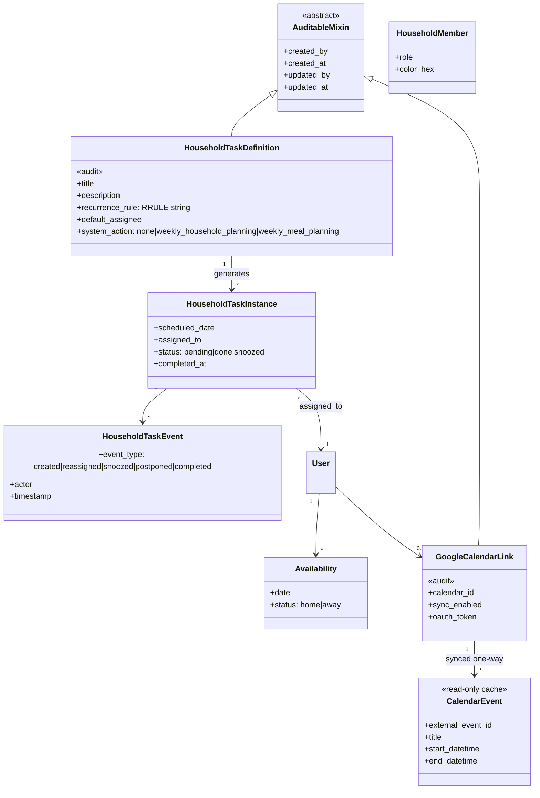
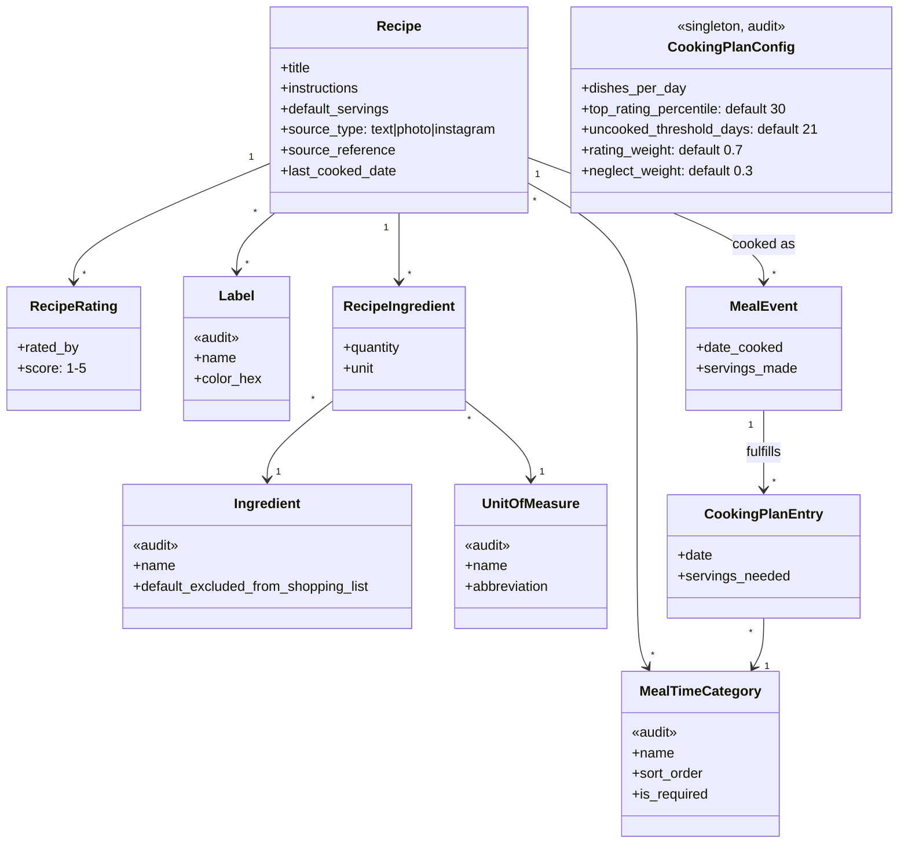
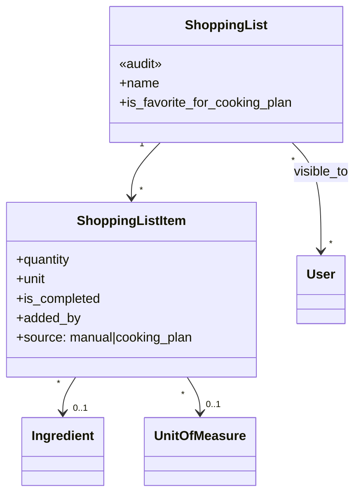
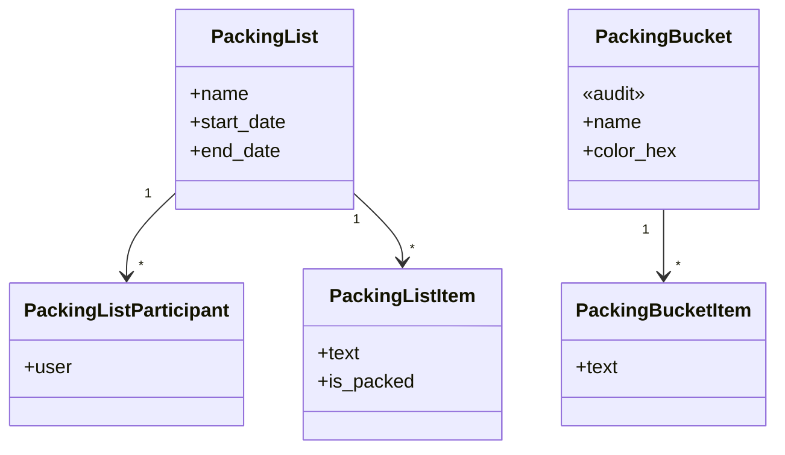
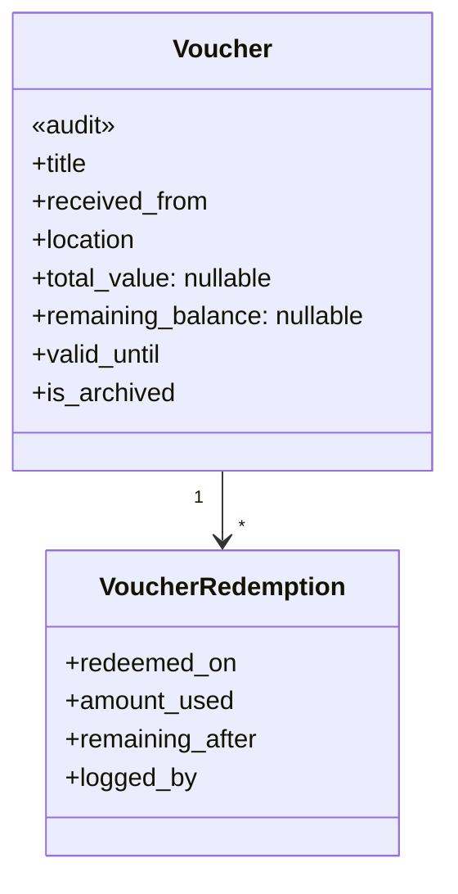
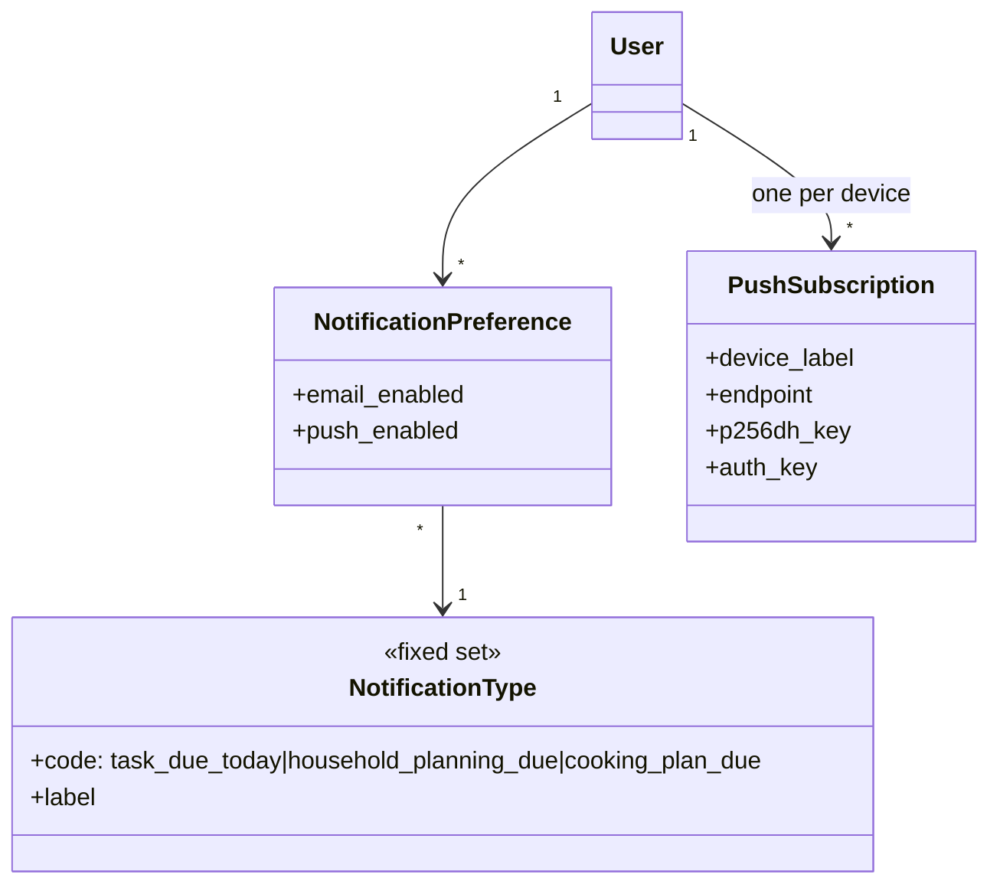

# Feature Plan

Domain model for the next phase of Husehold, covering household planning, cooking plan, shopping, recipes, packing lists, vouchers, and supporting features (config, analytics, notifications). See [CLAUDE.md](CLAUDE.md) *(gitignored, local only)* for day-to-day dev/deploy context, and [README.md](README.md)/[DEPLOYMENT.md](DEPLOYMENT.md) for setup.

Current state: this is a target model, not a migration plan. The existing `backend/household/models.py` (flat `ShoppingListItem`, `Recipe`, `CookingPlan`, `HouseholdTask`) will be substantially restructured to reach this — see [Suggested build order](#4-suggested-build-order) for how that's phased.

## 0. Decisions

- **Config**: editable by both household members, no admin gating. Every config-editable record tracks who created/last-updated it and when, via a shared `AuditableMixin` rather than repeating fields per table.
- **Recipe import (photo/Instagram)**: deferred to the last build phase, alongside notifications and calendar sync.
- **Notifications**: both email and phone push (via the home-screen web app), grouped into clustered types (task due today, weekly household planning due, weekly cooking plan due, ...), each independently toggleable per channel per user.
- **Google Calendar**: one-way only, shown as a read-only overlay in the weekly planning view so you can see who's traveling/busy while assigning tasks and meals.
- **Recipe recommendation lists**: three ranked, mutually-exclusive buckets per meal-time category — *Craving for it* (combined rating+neglect score) > *Top 30% rated* > *Not cooked in 21+ days* > everything else. 1–5 star ratings per member, average shown. Free-form **labels** (e.g. "Tim's Favorite", "10min Fast Track") that members define and assign, searchable as a tab in the Cooking Plan.
- **Recurrence**: full Outlook-style flexibility, including "first Monday of the month" — solved by storing a standard [RFC 5545 RRULE](https://www.rfc-editor.org/rfc/rfc5545) string rather than hand-rolling recurrence fields (Python's `dateutil.rrule` already implements the whole spec).
- **Role enforcement**: confirmed still equal permissions everywhere, including all config.
- **UX**: color-coded task cards by assignee (color configurable per member) in a drag-and-drop weekly view — first-class requirement of Phase 1, not later polish.
- **Visual styling**: out of scope for this planning pass. The diagrams above cover data/behavior only — layout, typography, and overall design system for the new screens will be discussed separately once a phase is ready to build.

## 1. Use Case Diagram

```mermaid
graph TD
  Member(["Household Member"])
  Admin(["Admin"])

  subgraph Home["Home Dashboard"]
    UC_home[View overdue tasks, progress,<br/>today's meals, today's tasks]
  end

  subgraph Plan["Household Plan"]
    UC_p1[Weekly view: color-coded,<br/>drag-and-drop tasks onto days]
    UC_p2[Reassign a task]
    UC_p3[Snooze a task]
    UC_p4[Postpone a task]
    UC_p5[Set own availability]
    UC_p6[View Google Calendar overlay<br/>-- who's away when]
    UC_p7[Configure task recurrence -- RRULE]
    UC_p8[Configure member colors]
  end

  subgraph Cook["Cooking Plan"]
    UC_c1[Weekly meal planning session]
    UC_c2[Browse Craving / Top-rated /<br/>Not-cooked-recently / All]
    UC_c3[Search recipes by label]
    UC_c4[Send planned meal to shopping list]
    UC_c5[Mark one dish as covering multiple meals]
  end

  subgraph Shop["Shopping"]
    UC_s1[Maintain multiple shopping lists]
    UC_s2[Check off item -- removed for everyone]
    UC_s3[Mark a list as favorite]
  end

  subgraph Rec["Recipes"]
    UC_r1[Add recipe via text]
    UC_r2[["Add recipe via cookbook photo"]]
    UC_r3[["Add recipe via Instagram video"]]
    UC_r4[Rate a recipe 1-5 stars]
    UC_r5[Create + assign labels]
  end

  subgraph Trip["Packing Lists"]
    UC_t1[Create a packing list, add participants<br/>+ trip dates via a popup]
    UC_t2[Configure reusable item buckets<br/>-- e.g. "Sommerurlaub"]
    UC_t3[Add a bucket's items to a list at once]
    UC_t4[Check off / edit / delete<br/>items on the shared list]
    UC_t5[Browse past packing lists]
  end

  subgraph Vouch["Vouchers"]
    UC_v1[Add a voucher -- from whom,<br/>value, where valid, expiry]
    UC_v2[Log a partial redemption --<br/>records remaining balance]
    UC_v3[Browse active vouchers,<br/>sorted by soonest-expiring]
    UC_v4[View archived -- fully used --<br/>vouchers, grayed out]
  end

  subgraph Analytics["Analytics"]
    UC_an1[View household stats --<br/>tasks, meals, spending over time]
  end

  subgraph Admin_Sec["Admin only"]
    UC_a1[Manage user accounts]
    UC_a2[Database access]
  end

  subgraph Config["Config -- open to all members"]
    UC_cfg1[Configure recurring tasks]
    UC_cfg2[Configure meal-time categories]
    UC_cfg3[Configure shopping lists + visibility]
    UC_cfg4[Configure excluded ingredients + units]
    UC_cfg5[Configure notification preferences]
    UC_cfg6[["Connect Google Calendar"]]
  end

  subgraph Notif["Notifications"]
    UC_n1[Receive clustered email/push digests]
    UC_n2[Toggle each notification type<br/>per channel]
  end

  Member --> UC_home
  Member --> UC_p1
  Member --> UC_p2
  Member --> UC_p3
  Member --> UC_p4
  Member --> UC_p5
  Member --> UC_p6
  Member --> UC_p7
  Member --> UC_p8
  Member --> UC_c1
  Member --> UC_c2
  Member --> UC_c3
  Member --> UC_c4
  Member --> UC_c5
  Member --> UC_s1
  Member --> UC_s2
  Member --> UC_s3
  Member --> UC_r1
  Member --> UC_r2
  Member --> UC_r3
  Member --> UC_r4
  Member --> UC_r5
  Member --> UC_t1
  Member --> UC_t2
  Member --> UC_t3
  Member --> UC_t4
  Member --> UC_t5
  Member --> UC_v1
  Member --> UC_v2
  Member --> UC_v3
  Member --> UC_v4
  Member --> UC_an1
  Member --> UC_cfg1
  Member --> UC_cfg2
  Member --> UC_cfg3
  Member --> UC_cfg4
  Member --> UC_cfg5
  Member --> UC_cfg6
  Member --> UC_n1
  Member --> UC_n2
  Admin --> UC_a1
  Admin --> UC_a2

  classDef future stroke-dasharray: 4 3
  class UC_r2,UC_r3,UC_cfg6 future
```

Dashed = deferred to the last build phase (recipe photo/Instagram import, Google Calendar connect).

## 2a. Household Plan & Tasks

*(Haushaltsplan)*

All config-editable entities (marked `«audit»`) share one abstract base carrying `created_by`, `created_at`, `updated_by`, `updated_at`. Recurrence is a single RRULE string per `HouseholdTaskDefinition`, parsed with `dateutil.rrule` — this is what buys "first Monday of the month" for free instead of hand-rolled interval/weekday fields.

```mermaid
classDiagram
  class AuditableMixin {
    <<abstract>>
    +created_by
    +created_at
    +updated_by
    +updated_at
  }

  class HouseholdMember {
    +role
    +color_hex
  }

  class HouseholdTaskDefinition {
    «audit»
    +title
    +description
    +recurrence_rule: RRULE string
    +default_assignee
    +system_action: none|weekly_household_planning|weekly_meal_planning
  }

  class HouseholdTaskInstance {
    +scheduled_date
    +assigned_to
    +status: pending|done|snoozed
    +completed_at
  }

  class HouseholdTaskEvent {
    +event_type: created|reassigned|snoozed|postponed|completed
    +actor
    +timestamp
  }

  class Availability {
    +date
    +status: home|away
  }

  class GoogleCalendarLink {
    «audit»
    +calendar_id
    +sync_enabled
    +oauth_token
  }

  class CalendarEvent {
    <<read-only cache>>
    +external_event_id
    +title
    +start_datetime
    +end_datetime
  }

  AuditableMixin <|-- HouseholdTaskDefinition
  AuditableMixin <|-- GoogleCalendarLink
  HouseholdTaskDefinition "1" --> "*" HouseholdTaskInstance : generates
  HouseholdTaskInstance "1" --> "*" HouseholdTaskEvent
  HouseholdTaskInstance "*" --> "1" User : assigned_to
  User "1" --> "*" Availability
  User "1" --> "0..1" GoogleCalendarLink
  GoogleCalendarLink "1" --> "*" CalendarEvent : synced one-way
```

| Decision | Modeled as |
|---|---|
| Color-coded weekly view | `HouseholdMember.color_hex`, set in Config; the weekly drag-and-drop UI colors each `HouseholdTaskInstance` card by `assigned_to`'s color. |
| Outlook-style recurrence | `HouseholdTaskDefinition.recurrence_rule` stores an RFC 5545 RRULE string (e.g. `FREQ=MONTHLY;BYDAY=1MO` for "first Monday of the month"); `dateutil.rrule.rrulestr()` expands it into dates. |
| Calendar overlay | `CalendarEvent` is a read-only, periodically-synced mirror of the linked Google Calendar, rendered alongside `HouseholdTaskInstance`/`CookingPlanEntry` in the same weekly view — informational only, never written back to Google. |
| Audit trail on config | `AuditableMixin` inherited by every config-editable model across all domains (see 2b/2c/2e/2f too). |

## 2b. Meal Planning & Recipes

*(Kochplan · Rezepte)*

The three recommendation buckets are a ranking query, not stored fields — computed per `MealTimeCategory` so "top 30% for dinner" and "top 30% for dessert" are independent.

```mermaid
classDiagram
  class MealTimeCategory {
    «audit»
    +name
    +sort_order
    +is_required
  }

  class Recipe {
    +title
    +instructions
    +default_servings
    +source_type: text|photo|instagram
    +source_reference
    +last_cooked_date
  }

  class RecipeRating {
    +rated_by
    +score: 1-5
  }

  class Label {
    «audit»
    +name
    +color_hex
  }

  class RecipeIngredient {
    +quantity
    +unit
  }

  class Ingredient {
    «audit»
    +name
    +default_excluded_from_shopping_list
  }

  class UnitOfMeasure {
    «audit»
    +name
    +abbreviation
  }

  class MealEvent {
    +date_cooked
    +servings_made
  }

  class CookingPlanEntry {
    +date
    +servings_needed
  }

  class CookingPlanConfig {
    <<singleton, audit>>
    +dishes_per_day
    +top_rating_percentile: default 30
    +uncooked_threshold_days: default 21
    +rating_weight: default 0.7
    +neglect_weight: default 0.3
  }

  Recipe "*" --> "*" MealTimeCategory
  Recipe "*" --> "*" Label
  Recipe "1" --> "*" RecipeIngredient
  RecipeIngredient "*" --> "1" Ingredient
  RecipeIngredient "*" --> "1" UnitOfMeasure
  Recipe "1" --> "*" RecipeRating
  Recipe "1" --> "*" MealEvent : cooked as
  MealEvent "1" --> "*" CookingPlanEntry : fulfills
  CookingPlanEntry "*" --> "1" MealTimeCategory
```

| Decision | Modeled as |
|---|---|
| Craving / Top 30% / Not-cooked-21+ / Rest | Ranking query per `MealTimeCategory`, evaluated top-down and mutually exclusive: **1)** Craving = highest combined score of (rating percentile × `rating_weight` + neglect percentile × `neglect_weight`), weighted toward rating since the recipe list is expected to already skew toward liked dishes, **2)** remaining recipes in top `top_rating_percentile`% by average `RecipeRating.score`, **3)** remaining recipes with `last_cooked_date` older than `uncooked_threshold_days`, **4)** everything else. Thresholds and weights live on `CookingPlanConfig` so they're tunable. |
| 1–5 star ratings, average shown | `RecipeRating` one row per (`recipe`, `rated_by`); UI shows each member's score plus the average. |
| Labels, member-defined, searchable tab | `Label` (audited) with a plain M2M to `Recipe`; Cooking Plan gets a "browse by label" tab alongside the four ranked buckets. |
| Photo / Instagram import | `Recipe.source_type`/`source_reference` fields reserved now, extraction pipeline deferred (see Phase 9). |

## 2c. Shopping

*(Einkaufsplan)*

```mermaid
classDiagram
  class ShoppingList {
    «audit»
    +name
    +is_favorite_for_cooking_plan
  }
  class ShoppingListItem {
    +quantity
    +unit
    +is_completed
    +added_by
    +source: manual|cooking_plan
  }
  ShoppingList "1" --> "*" ShoppingListItem
  ShoppingList "*" --> "*" User : visible_to
  ShoppingListItem "*" --> "0..1" Ingredient
  ShoppingListItem "*" --> "0..1" UnitOfMeasure
```

Unchanged from the earlier draft other than inheriting `AuditableMixin` on `ShoppingList`, since it's config-managed (visibility, favorite flag).

## 2d. Packing Lists

*(Packlisten)*

Revised after Tim's first click-through (2026-09-24): items are one flat, shared checklist per packing list rather than split per participant, and personal default items were dropped in favor of shared, household-wide "buckets" (reusable item-set templates such as "Übernachten" → Kulturbeutel, "Sommerurlaub" → Sonnencreme/Badehose) that can be added to a list as a whole.

```mermaid
classDiagram
  class PackingList {
    +name
    +start_date
    +end_date
  }
  class PackingListParticipant {
    +user
  }
  class PackingListItem {
    +text
    +is_packed
  }
  class PackingBucket {
    «audit»
    +name
    +color_hex
  }
  class PackingBucketItem {
    +text
  }
  PackingList "1" --> "*" PackingListParticipant
  PackingList "1" --> "*" PackingListItem
  PackingBucket "1" --> "*" PackingBucketItem
```

Fully independent of every other domain — safe to build in any order. Adding a bucket to a list copies its items as a one-time snapshot (`PackingListViewSet.add_bucket`) -- editing the bucket template afterward never changes lists it was already added to.

## 2e. Vouchers

*(Gutscheine)*

A standalone tracker, unrelated to shopping/cooking — mainly for gifts from friends/family: store vouchers, but also non-monetary presents like a dinner invitation that have no numeric value. Vouchers get redeemed partially over time rather than in one go, so each redemption is logged rather than just decrementing a number — the remaining balance has a history instead of only a current snapshot.

```mermaid
classDiagram
  class Voucher {
    «audit»
    +title
    +received_from
    +location
    +total_value: nullable
    +remaining_balance: nullable
    +valid_until
    +is_archived
  }

  class VoucherRedemption {
    +redeemed_on
    +amount_used
    +remaining_after
    +logged_by
  }

  Voucher "1" --> "*" VoucherRedemption
```

| Decision | Modeled as |
|---|---|
| Title | `Voucher.title` — short free-text label (e.g. "Christmas voucher from Mom", "Dinner at Lisa & Jan's"), shown as the card heading. |
| From whom | `Voucher.received_from` — free text, since gifters aren't household members with accounts. |
| Location it's valid for | `Voucher.location` — store/restaurant/site the voucher can be redeemed at. |
| Value can be blank | `Voucher.total_value`/`remaining_balance` are nullable — a monetary store voucher has a value, but a non-monetary gift (e.g. a dinner invitation) just leaves both blank and tracks title/from/location/expiry only. |
| Partial use tracked over time | `VoucherRedemption` logs each redemption (`amount_used`) with a `remaining_after` snapshot; `Voucher.remaining_balance` is kept in sync as the current total, so the UI doesn't need to replay the log to show a balance. Only meaningful when `total_value` is set — a valueless gift just gets marked used/archived directly. |
| List sorted by validity | Active vouchers list sorted by `valid_until` ascending — soonest-expiring first. |
| Fully used vouchers archived | Once `remaining_balance` reaches 0, `Voucher.is_archived` is set (automatically, on the redemption that empties it) and the card renders grayed-out in an "Archive" section instead of the active list. |

Fully independent of every other domain — safe to build in any order, same as Packing Lists.

## 2f. Config, Analytics & Notifications

*(Support Features)*

```mermaid
classDiagram
  class NotificationType {
    <<fixed set>>
    +code: task_due_today|household_planning_due|cooking_plan_due
    +label
  }
  class NotificationPreference {
    +email_enabled
    +push_enabled
  }
  class PushSubscription {
    +device_label
    +endpoint
    +p256dh_key
    +auth_key
  }
  User "1" --> "*" PushSubscription : one per device
  User "1" --> "*" NotificationPreference
  NotificationPreference "*" --> "1" NotificationType
```

| Decision | Modeled as |
|---|---|
| Clustered notification types | `NotificationType` is a small fixed set (task due today, household planning due, cooking plan due, ...) rather than one generic on/off switch. |
| Per-type, per-channel toggle | `NotificationPreference(user, notification_type)` carries independent `email_enabled` / `push_enabled` booleans. |
| Push to phone from the home-screen web app | Standard Web Push API: each installed instance (iPhone, Android) registers a `PushSubscription` with its own endpoint/keys. **Constraint:** Web Push requires a secure context (HTTPS) — the Pi currently serves plain HTTP, so this needs a TLS cert in front of Nginx before push can work at all. |
| Email | Plain SMTP send, triggered by the same scheduled job that checks push. |
| Delivery scheduling | Needs a periodic job on the Pi — a cron-triggered Django management command is the simplest fit for a Pi 3, no need for a full Celery+broker setup at this volume. |

Analytics is unchanged — still pure queries, no new tables — but the new audit fields add a free extra: a "who changed this config item and when" history view becomes possible everywhere `AuditableMixin` is used.

## 3. Cross-domain dependencies

| From | To | Nature |
|---|---|---|
| Cooking Plan | Household Plan | Weekly meal planning is a `HouseholdTaskDefinition` occurrence. |
| Cooking Plan | Recipes | Needs structured ingredients + ratings + labels to power the four recommendation buckets. |
| Cooking Plan | Shopping | Writes into the favorite (or chosen) `ShoppingList`. |
| Household Plan | Google Calendar | One-way `CalendarEvent` overlay in the weekly view — read-only, no write-back. |
| Notifications | Household Plan, Cooking Plan | Reads due `HouseholdTaskInstance`/`CookingPlanEntry` rows; needs the scheduler + HTTPS decisions below regardless of trigger source. |
| Everything config-editable | AuditableMixin | Shared base, touches almost every model — worth introducing in Phase 1 rather than retrofitting later. |
| Analytics | Everything, including Vouchers | Read-only. Swapped ahead of Config screens (see section 4, step 7) once the other domains had enough history to make it worthwhile. |
| Packing Lists | (none) | Fully independent. |
| Vouchers | (none) | Fully independent. |

## 4. Suggested build order

See [PHASE1_PLAN.md](PHASE1_PLAN.md) for the concrete implementation plan for step 1 (Task engine core — already shipped and deployed).

0. **Vouchers** *(shipped)* — `Voucher`/`VoucherRedemption`, redemption slider, expiring-soon indicator (6-month lookahead, also surfaced as a count in the dashboard overview panel), inline editing (value locked once a redemption is logged), manual archive/unarchive.
1. **Task engine core** *(shipped)* — `AuditableMixin` introduced here (used everywhere after), `HouseholdTaskDefinition` with RRULE recurrence, `HouseholdTaskInstance`/`HouseholdTaskEvent`, reassignment/snooze/postpone, color-coded drag-and-drop weekly view, `HouseholdMember.color_hex`.
2. **Recipes with structure** *(built, not yet deployed)* — `Ingredient` (free-text entry, auto-created case-insensitively), `UnitOfMeasure` (plain labels, no conversion), `RecipeIngredient`, `RecipeRating` (1-5 per member, both scores + average shown), `Label` (seeded starter set, editable), `MealTimeCategory` (Frühstück/Mittagessen/Abendessen/Dessert & Snacks) -- labels, meal types and units are bilingual (`name_de` required, `name_en` optional, UI falls back to German; ingredients stay single-language free text), servings scaling with fraction rounding, pasted-ingredient-list import, prep/cook time, source link, notes. Config editors live in Settings. Also includes the `MealEvent` cooking log ("I cooked this" on a recipe: date + servings, derived last-cooked/times-cooked, queryable by day/range via `/meal-events/`) with a rate-after-cooking prompt -- the history the Cooking Plan will rank on. Deliberately **not** included: photos.
3. **Shopping list depth** *(built, not yet deployed)* — `ShoppingList` (favorite flag, empty `visible_to` = everyone), items with quantity/unit and an optional `Ingredient` link (auto-matched by name), clear-completed. Existing items were backfilled into a default "Einkaufsliste". Also a purchase history (`PurchaseRecord`, written on tick-off, undone on un-tick, independent of item deletion) with a History tab (most bought, add again, recent by day) -- the data source for the later Analytics phase.
4. **Cooking Plan proper** *(built and deployed 2026-09-21)* — weekly plan over the configured meals (default lunch + dinner); suggestion buckets craving / best rated / not cooked in a while / **random picks (added before "rest")** / rest, plus search and label filter (`CookingPlanConfig`, `services/cooking_suggestions.py`); "leftovers of ..." entries; the plan is driven by the recurring `weekly_meal_planning` task, and finishing creates one `cook_meal` task per dish in the household plan (**one entry = one task**: dragging moves the dish, skip takes it out of the plan, snooze carries it to next week, delete removes it); ticking the task logs the `MealEvent` and asks for a missing rating; per-dish shopping-list dialog (untick dishes/ingredients, staples pre-unticked, merged by ingredient+unit) from the plan and from a recipe; notifications `meal_planning_due` and `cooking_today` (08:00, assignee or whole household while unassigned). Replaces the old empty `CookingPlan` scaffold. Not built: drag-and-drop inside the plan grid (moving is done via the entry's editor or by dragging the task in the household plan), a stored 'dishes per day' limit.

### Follow-up after Tim's first click-through (2026-09-24)

Free dishes (no recipe -- ready meals etc.), leftovers restricted to a slot *after* their dish (day or same-day-later-meal), the Dashboard's "Diese Woche" / This Week widget (`WeekPreview`) now shows a second row of planned meals per day, replacing the old "Cooking today" card, meal planning made step 1 of weekly household planning (a modal, skippable), the cooking plan itself is scoped to the current and next week only (arrows toggle between them; other entry points clamp into that range), per-member notification language (German default, independent of the UI language -- every notification type now exists in both languages), and "stay logged in" (180-day rotating refresh tokens + automatic silent refresh) with Home Screen / iOS Web Push guidance.

### Further follow-up (2026-09-24, later)

`CookingPlanEntry.shopping_added_at` tracks whether a dish's ingredients were already sent to a shopping list -- the shopping-preview dialog now shows "already on the list" and leaves those dishes unticked by default instead of quietly offering to add them again every time the plan is finalized (still tickable to add/top up again on purpose). Shopping list items gained inline editing (title/quantity/unit) -- previously only toggle-complete and delete existed.
5. **Home dashboard** *(built and deployed 2026-09-24)* — extended beyond the original "My Open Household Tasks" + Overview KPIs + `WeekPreview`, all still frontend-only (no new endpoint, no stored progress field): a combined `TasksPanel` (own open tasks, then the rest of the household's overdue tasks in the same card, so a separate overdue panel wasn't needed), `ProgressPanel` (this week's completion -- overall bar plus one per member, `skipped`/`snoozed` excluded from both numerator and denominator), and `TodaysMealsPanel` (today's `CookingPlanEntry` rows with a one-click "mark cooked" that reuses the existing `taskInstanceService.complete` + rating-prompt flow). Grid is 2x2 (`TasksPanel`, `OverviewPanel`, `ProgressPanel`, `TodaysMealsPanel`) above the untouched `WeekPreview`. `TaskRow` extracted into its own component so the inline complete/skip/snooze actions aren't duplicated between panels.
6. **Packing Lists** *(built and deployed 2026-09-24; redesigned same day after Tim's feedback)* — `PackingList`/`PackingListParticipant`/`PackingListItem` (one flat, shared checklist per list, not split per participant) plus `PackingBucket`/`PackingBucketItem` (`AuditableMixin`, shared household config, replacing the earlier per-user default-items idea) -- adding a bucket to a list (`PackingListViewSet.add_bucket`) copies its items as a one-time snapshot, editing the bucket template afterward never changes lists it was already added to. `/packing-lists` page mirrors the Shopping List page's UX (pill-tab list picker, inline "Reiseeinstellungen" panel analogous to "Listeneinstellungen", simple add/toggle/edit/delete items), Upcoming/Past pill grouping kept from the original design. Creating a list: type just the name inline, then `CreatePackingListModal` collects the mandatory dates + at least one participant before the list is actually persisted (`PackingListViewSet.perform_create` 400s on zero participants) -- nothing incomplete is ever saved. `/packing-buckets` config screen (reachable via a button on the packing-lists page, not tucked into Settings) manages buckets and their items, mirroring the same list-detail pattern. Navbar link and a dashboard `OverviewPanel` KPI row (upcoming packing-list count). A bucket can only be added to a given list once (`PackingList.added_buckets` guards against a second add-bucket call), and item names are deduplicated case-insensitively within a list -- manual add/rename of a duplicate name is rejected (400), a bucket add silently skips items that already match an existing name instead of erroring, since it's a batch operation. Independent of every other domain, per section 3. Gained a manual archive (`PackingList.is_archived`, `toggle-archived` action, same convention as `Voucher`) on 2026-09-27 as part of the config-navigation harmonization below -- archived lists drop out of Upcoming/Past into a collapsed-by-default `
` "Archiv" section, toggled from the list's own settings panel.
7. **Analytics** *(built and deployed 2026-09-27)* — swapped ahead of Config screens (Tim, 2026-09-26): pure read-only queries (`services/analytics.py`, `GET /api/analytics/?start=&end=`) over tasks, the `MealEvent` cooking log, `PurchaseRecord`, and `Voucher`/`VoucherRedemption` -- no new tables, no price field added to Purchases (that stat is frequency/volume, not spending -- there's no price anywhere in the app yet). Trend buckets are weekly under a ~90-day range and monthly above it, so a year of history doesn't render as 52 unreadable bars. `/analytics` page (own nav link, single scrollable page, one section per domain, same 30-days/year/all-time period selector as Purchase History) with five thin `recharts` wrappers (`components/charts/`) -- `StackedBarChart` (task completion split by member, absolute + %, using each member's existing `color_hex`), `PieChart` (the same per-member completed counts as a share-of-whole view, next to the trend below), `TrendLineChart` (a 0-100% rate over time, y-axis fixed to `[0, 1]` rather than autoscaled), `TrendBarChart` (a value-over-time bar chart), `RankedList` (a horizontal bar chart ranked by magnitude, for top recipes / top purchased items). First shipped as five from-scratch dependency-free primitives because the npm registry seemed unreachable overnight (Node's `fetch`/undici hangs in this sandbox trying IPv6 first, even with `--dns-result-order=ipv4first` set -- `curl` and `https.get({family: 4})` both work fine); once that turned out to be a local DNS quirk rather than no connectivity, `recharts` was installed for real (routed through a throwaway local IPv4-forcing proxy for the one install) and swapped in behind the same component API, so nothing above them had to change. The Tasks section additionally tracks an on-time trend -- `task_stats()` buckets by calendar week *unconditionally* (unlike every other trend here, which switches to monthly past a ~90-day range) since a line chart, unlike a bar chart, reads fine dense; a task counts "on time" when `status='done'` and `completed_at`'s date is on or before `scheduled_date`, with the same backlog/skipped/snoozed exclusions as the rest of `task_stats`.
8. **Config screens** — built alongside each domain as it lands. Harmonized on 2026-09-27 (Tim's request): every page with its own config now uses the same entry point, a gear icon (`components/icons/gearIcon.jsx`) placed top-right in that page's header row, replacing whatever bespoke text button (or Settings-page section) used to do the job -- Shopping and Recipes both point to one new dedicated page, `/recipe-shopping-config` (`RecipeShoppingConfig.jsx`, wrapping the existing `RecipeConfig` -- moved out of `Settings.jsx`, since labels/units/ingredients are domain config, not system settings), Cooking Plan's gear sits right of its "Plan abschließen" button, Household Plan's replaces the old "Wiederkehrende Aufgaben verwalten" text button, Packing Lists' replaces "Buckets verwalten". Vouchers and Analytics have no config, so no gear icon. Same pass also reordered the navbar (dropped the "Übersicht" link -- the logo already goes there -- reordered to Shopping/Household Plan/Cooking Plan/Recipes, and moved Packing Lists/Vouchers/Analytics into a `MoreMenu` "Weitere" dropdown so the main row doesn't grow with every new domain) and added a small member avatar next to each row of the Dashboard's per-member progress bars (`ProgressPanel`, reusing `HouseholdMember.avatar`/`color_hex` the same way `AccountMenu` already does). Two same-day fixes: `MoreMenu`'s dropdown was nested inside the navbar's `overflow-x-auto` link row, which -- since `overflow-x` without an explicit `overflow-y` makes the browser compute the other axis as `auto` too -- clipped the dropdown down to an empty scrollable sliver; moved it to a sibling of that scrolling row instead. Both dedicated config pages (`/recipe-shopping-config`, `/packing-buckets`) also gained a top-left "← Back" affordance -- a fixed `Link` back to `/packing-lists` for the latter (unambiguous), browser-history `navigate(-1)` for the former (shared by both Recipes and Shopping, so there's no single fixed destination). Follow-up the same week: Cooking Plan's settings moved off the Cooking Plan page too, onto its own `/cooking-plan-config` (`CookingPlanConfig.jsx`, wrapping the existing `CookingPlanSettings`) with a fixed "← Back" `Link` to `/cooking-plan` (unambiguous, same reasoning as Packing Lists' back link) -- the gear icon there is now a `Link`, not a same-page toggle. Household Plan's inline config mode (still same-page, not its own route, since it's a `TaskDefinitionForm` swapped in over the calendar rather than a full page) also gained the same top-left "← Back" button, wired to the existing `setMode('calendar')` handler.
9. **Deferred bundle:** Google Calendar one-way sync, recipe import from photo/Instagram. **Notifications built ahead of schedule** (see below) once HTTPS landed on the Pi.

### Reassessment after adding Vouchers (2026-09-18)

Packing Lists and Analytics were already scoped in the plan (2d and 2f respectively) — the frontend's empty template tabs for those just need backend models to catch up. Vouchers was net-new and is now modeled in 2e, expanded to cover non-monetary gifts (title, from-whom, location, optional value). It has no cross-domain dependencies (see section 3) and is now the smallest fully-unbuilt domain, so it's called out as **step 0** — ahead of the numbered order — as the next thing to work on, without renumbering the already-shipped Task Engine (step 1, per [PHASE1_PLAN.md](PHASE1_PLAN.md)) or the phases after it.

### Notifications -- built ahead of schedule

Originally deferred to this phase, but built immediately after Phase 1 once HTTPS was set up on the Pi (self-signed cert, since there's no public domain for Let's Encrypt). Covers the two notification types that exist today -- `task_due_today` and `household_planning_due` -- via email (SMTP, through Brevo's free tier) and Web Push, both toggleable per user in Settings. Delivery is a `send_notifications` management command on a cron schedule (every 15 min on the Pi), not a background daemon, guarded against double-sends by `NotificationLog`. A `cooking_plan_due` type will need adding once Phase 4 (Cooking Plan) lands -- the model already supports adding types without a migration to the fixed set.

## 5. Decisions (round 3) and remaining open questions

- **HTTPS**: self-signed cert, kept simple. Only needed **on the Pi** — that's the machine a phone actually connects to for push. The laptop dev setup doesn't need one: browsers treat `http://localhost` as a secure context, so Web Push works fine there without a cert. Only the Pi's Nginx needs a self-signed cert; expect a one-time browser warning on each device the first time it connects (can be accepted permanently in most mobile browsers).
- **Craving-score formula**: resolved — weighted toward rating (`rating_weight: 0.7`, `neglect_weight: 0.3` by default) rather than an equal split, since the recipe list is expected to already lean toward liked dishes.
- **Recipe import service**: still deferred, no decision needed yet — flagging that it'll eventually mean picking (and likely paying for) an OCR/transcription service, since the Pi can't run that kind of model locally.

## 6. New requirements backlog (added 2026-09-28)

Permissions gap (previously flagged as open in step 1) is now confirmed closed. `meal_planning_due` and `cooking_today` notification types were already added when Cooking Plan shipped (2026-09-21) — the "still needs adding" note in step 9 above was stale and has been superseded by this section.

| # | Requirement | Domain(s) touched | Notes |
|---|---|---|---|
| A | Recipe "Highlight mode" *(shipped 2026-09-28, see note below)*. | Recipes, Home dashboard | — |
| B | Copy an existing packing list's items into a new one *(shipped 2026-09-28, see note below)*. | Packing Lists | — |
| C | Google Calendar integration — one-way sync, read-only overlay in the weekly planning view *(code shipped 2026-09-28, see note below — needs Tim's Google Cloud OAuth credentials before it actually works)*. | Household Plan | — |
| D | Recipe import from a photo, pasted text, or a URL *(shipped 2026-09-30/10-01, see note below)*. | Recipes | — |
| E | Shopping list items clustered thematically, auto-categorized *(shipped 2026-09-30, see note below)*. | Shopping | — |
| F | New notification types -- vouchers expiring in the next 30 days, a packing trip starting tomorrow *(shipped 2026-10-01, see note below)*. | Notifications, Vouchers, Packing Lists | — |
| G | More visually engaging UI, mobile-optimized; consider adding a library/tooling to preview mobile viewports locally in the browser during laptop dev. | Cross-cutting (frontend) | Section 0 explicitly deferred visual styling/design system to "once a phase is ready to build" — this is that phase. Tooling ask (device-frame/responsive preview in dev) is separate from the design work itself — browser devtools device toolbar already covers basic viewport testing; a library would add device chrome/frame realism. |

### Item A shipped (2026-09-28) — Recipe Highlight mode, plus a round of follow-up fixes

- **Highlight mode**: new route `/recipes/:id/highlight` (`RecipeHighlight.jsx`) — large-text, scrollable recipe view (ingredients scaled to servings, instructions, then prep/cook time + notes shown smaller) for reading while cooking. Font-size +/- control (persisted per device via `localStorage`) and Wake Lock API (keeps the screen from dimming mid-recipe, re-acquired on tab refocus since browsers auto-release it when hidden). Back button uses browser history (`navigate(-1)`), so it always returns to wherever you came from.
- **Entry points**: an expand-icon button on the recipe detail modal, and the same icon on Dashboard's `WeekPreview` ("Diese Woche") and `TodaysMealsPanel` ("Heutige Mahlzeiten") rows — shown only for `kind='cook'` entries with a linked recipe (free dishes and leftovers get none, since there's no single recipe to jump to).
- **Follow-up fixes from the same review round**:
  - **Sources**: `Recipe.source_url` (URL-only) renamed to `Recipe.source` (free text — a link, or "Rezept von Mama"/"Kochbuch Jamie Oliver") plus a new `source_type` field (manual/website/photo/instagram, picked in the recipe form). The detail view and Highlight mode render it as a clickable link only when it's actually a URL. Migration 0030 hand-fixed to a `RenameField` (same gotcha as migrations 0017-0019 in step 2 — auto-generated makemigrations produces remove+add and would have dropped every recipe's existing link).
  - **Shopping list servings**: `AddToShoppingDialog` gained a +/- servings control per dish (recipe-backed dishes only), refetching scaled quantities live via the existing `/recipes/{id}/shopping-lines/` endpoint — works both from a single recipe and from the Cooking Plan's weekly shopping preview.
  - **Icon consistency**: the Highlight-mode entry button changed from a text label to an icon-only button (`components/icons/expandIcon.jsx`, same flat single-color treatment as `gearIcon.jsx`); the dashboard rows' plain `⤢` character was replaced with the same icon component.
  - **Added-by metadata**: both the recipe detail view and Highlight mode now show a small line — "Added {{date}} by {{user}} · {{source_type label}}" — using the `created_by`/`created_at` fields already on `Recipe`.

### Item B shipped (2026-09-28) — Copy a packing list

- **New `PackingListViewSet.copy` action** (`POST /packing-lists/{id}/copy/`): creates a brand-new `PackingList` from the same name/dates/participant validation as a normal create, then bulk-copies the source list's items with `is_packed` reset to false (it's a new trip). Bucket-add history does **not** carry over — a bucket already reflected in the copied items can still be added fresh to the new list, since the copy has no `added_buckets` of its own.
- **Entry point**: a small copy icon next to every list's name pill (`CopyIcon`, same flat single-color treatment as `expandIcon.jsx`/`gearIcon.jsx`) — available on any list, not just past/archived ones, per Tim's answer that a duplicate is also useful for an active trip. Opens the create/edit modal (same "nothing incomplete is ever saved" validation as a fresh create) pre-filled with the source list's participants and a name of "{{original}} (Kopie)"; dates are left empty since a copy is for a *different* trip. On submit, the page calls `copy` instead of `create` and jumps straight to the new list.
- Covered by 3 new backend tests (`PackingListTests`): items copy unpacked and the source list is untouched, at least one participant is still required, and bucket history doesn't carry over (the same bucket can be added again to the copy).

### Item B follow-up (2026-09-28, same day) — creation/edit UI reworked to match Recipes' pattern

Tim asked for the create/copy flow to match how Recipes handles new/edit, and for per-list editing to move off the page into the same popup rather than the inline "Reiseeinstellungen" panel.

- `CreatePackingListModal.jsx` replaced by `PackingListFormModal.jsx` — one modal for all three flows (`mode: 'create' | 'copy' | 'edit'`), varying its title/submit label and, in edit mode only, showing Archive/Unarchive and Delete at the bottom (so the inline settings panel disappears entirely).
- Page header gained a "+ New Packing List" button left of the gear icon (`recipes.jsx`'s "+ New recipe" layout) creating the list, removing the old inline "type a name, then press +" form.
- Each list pill now carries two icon buttons: the existing Copy, plus a new Edit (`EditIcon`, same treatment) that opens the modal pre-filled with that list's current name/dates/participants.
- Backend: `PackingListViewSet.perform_update` now syncs participants from an optional `participant_ids` in the PATCH body (added/removed to match exactly), letting one edit-modal submit update everything at once instead of the old per-checkbox `add-participant`/`remove-participant` calls. Omitting the field (any other PATCH) leaves participants untouched; sending an empty list 400s, same "at least one participant" rule as create. 3 more backend tests cover the sync, the untouched-when-omitted case, and the can't-clear-to-zero guard (157 backend tests total).

### Item C shipped (2026-09-28) — Google Calendar one-way sync

Design decisions from Tim: **one shared household calendar** (not per-member — simpler than the original per-user `GoogleCalendarLink` sketch in section 2a, since the household already shares one calendar), sync **every 15 minutes** (same cadence as `send_notifications`), **only accepted/confirmed events** shown (declined skipped, tentative shown normally), overlay in **both** the weekly plan view and the weekly-planning session (dragging tasks onto days).

- **Hand-rolled OAuth/REST, not the Google API client library**: `services/google_calendar.py` talks to Google's plain OAuth2 and Calendar v3 REST endpoints with `requests` rather than `google-api-python-client`/`google-auth-oauthlib` — the household only ever needs three calls (consent URL, code exchange, list events), so the full client library's dependency tree wasn't worth it on a Pi 3. The access token is re-derived from the stored `refresh_token` on every sync run rather than cached with an expiry, since sync only runs every 15 minutes anyway.
- **Models**: `GoogleCalendarLink` (singleton via `.load()`, same pattern as `CookingPlanConfig` — `refresh_token`, `sync_enabled`, `last_synced_at`) and `CalendarEvent` (`link`, `external_event_id`, `title`, `start_datetime`, `end_datetime`, `is_all_day` — a rolling read-only cache, replaced each sync run rather than incrementally patched, which handles edits/cancellations for free without needing Google's sync-token machinery). Sync window: 7 days back, 60 days ahead.
- **OAuth flow**: `GoogleCalendarConnectUrlView` (authenticated) hands the frontend a real Google consent URL with a one-time `state` cached server-side; the frontend does a full `window.location.href` navigation (an OAuth redirect can't carry a JWT header, so this can't be a fetch). `GoogleCalendarCallbackView` is deliberately **unauthenticated** (Google's redirect back arrives as a plain browser navigation, no Authorization header possible) — the one-time `state` is the actual CSRF guard, single-use (deleted from cache on first use). On success it saves the `refresh_token` onto the singleton and redirects the browser to `{FRONTEND_URL}/settings?google_calendar=connected` (or `=error`); `FRONTEND_URL` is a new env var since dev's backend (`:8000`) and frontend (`:3000`) are different origins, unlike prod where Nginx serves both.
- **Event filtering**: an event is dropped if Google's own `status` is `cancelled`, or if the household's own attendee entry (`self: true`) shows `responseStatus: declined` — other invitees declining doesn't matter. All-day events use Google's exclusive-end-date convention (`is_all_day`, computed from whether the API returned `date` vs `dateTime`).
- **Frontend**: `Settings → Google Calendar` (connect/disconnect/pause-sync, last-synced time, a one-line success/error notice read from the `?google_calendar=` query param and then stripped from the URL). The overlay itself: a new "Calendar" row in Dashboard's `WeekPreview` (replacing the old "coming with Google Calendar sync" placeholder) and a small events block above the task list in each `TaskDayColumn` (so it shows in the Household Plan's calendar view *and* its weekly-planning mode, since both share `WeekBoard`) — `utils/calendarEvents.js`'s `eventsOnDay()` handles the exclusive-end-date multi-day math once, shared by both call sites.
- 16 new backend tests (`GoogleCalendarLinkTests`, `GoogleCalendarSyncTests`) cover the singleton, connect-url/callback/state handshake (including single-use and missing-refresh-token failure), the events endpoint's date filtering, and `sync()`'s filtering/all-day-parsing/stale-event-removal logic against mocked Google responses (173 backend tests total).

### Item C follow-up (2026-09-28/30) — Google Cloud setup done, immediate sync on connect, and an unresolved DNS blocker

- **Google Cloud OAuth client created**: `GOOGLE_CLIENT_ID`/`GOOGLE_CLIENT_SECRET` added to both the Pi's and dev's `backend/.env`, plus `FRONTEND_URL=https://husehold.duckdns.org` on the Pi. Consent screen in Testing mode, both household members added as test users. `sync_google_calendar` cron job added on the Pi (same 15-minute cadence as `send_notifications`, logs to `calendar-sync.log`).
- **Search Console domain verification hurdle**: Google refuses to let *anyone* complete the OAuth consent screen on a custom domain until that domain is verified in Google Search Console under the same Google account that owns the Cloud project — a routine site-ownership check, but trickier here since `husehold.duckdns.org` resolves to the Pi's private LAN IP (deliberately — never port-forwarded, see [[network-architecture]]). Google's HTML-file verification method fails outright since Google's crawler can't reach a private IP. Fixed by switching to a **Domain property + DNS TXT record** instead (Google only needs the TXT record to be publicly queryable, independent of what the A record points to) — set via the same DuckDNS token/update-API mechanism already used for the Let's Encrypt DNS-01 challenge. (First attempt was verified under the wrong Google account — Tim's wife's — and had to be redone under the correct one.)
- **`GoogleCalendarCallbackView` now syncs immediately on connect** rather than waiting for the next cron tick, so the overlay populates right away (best-effort — a sync failure right after a successful connect doesn't turn into an error page, cron retries regardless).
- **Confirmed working end-to-end against the local dev environment** (`localhost:8000`/`:3000` — exempt from the domain-verification requirement entirely, since `localhost` isn't a public domain).
- **Open, unresolved**: `husehold.duckdns.org` is unreachable ("server not found" — a DNS resolution failure, not a timeout) from both of Tim's usual devices — his laptop on home Wi-Fi, and his phone even on cellular data with Wi-Fi and WireGuard both off. Ruled out so far: the DNS record itself (confirmed correct and stable via Google's, Cloudflare's, and DuckDNS's own nameservers), the Pi (confirmed healthy — SSH reachable, direct-IP HTTPS returns 200), and a stale cache (persisted across two days and device restarts). Since the phone failure persists even off Wi-Fi/VPN, that's suspected to be the company phone's MDM-enforced DNS policy (common for corporate devices to filter known dynamic-DNS domains) — separate from the laptop's failure, which has no MDM and points instead at the FritzBox (either its upstream DNS resolver or its DNS-rebind protection, which by design blocks resolving a public hostname to a private IP -- exactly this setup). Investigation paused at Tim's request (2026-09-30) in favor of the working fallback below; FritzBox DNS-server/rebind-protection settings and a laptop hosts-file override (mapping the hostname straight to `192.168.178.49`, skipping DNS entirely for that one name) are the next things to try if revisited.
- **Practical fallback in place**: the app works fine day-to-day at `https://192.168.178.49` (self-signed cert, one-time browser warning) regardless of this issue — only the *one-time* Google Calendar OAuth connect step needs the real hostname (Google doesn't accept raw IP redirect URIs). Once that one connect succeeds from *any* device/network where the hostname resolves, ongoing sync is entirely server-side (cron + stored refresh token) and needs no further DNS resolution of the hostname at all.

### Item C follow-up (2026-09-30, later) — calendar picker, event colors, and a WeekPreview layout fix

Tim connected his real Google account and immediately found two gaps: no way to pick *which* of his calendars to sync (always hardcoded to `primary`), and no way to see the per-event colors he actually uses in Google Calendar.

- **Calendar picker**: `services/google_calendar.list_calendars()` calls Google's `users/me/calendarList` (reader access, so it's just the calendars the account can see, not just ones it owns) and returns `{id, summary, primary}` per calendar. New `GoogleCalendarCalendarListView` (`GET /api/google-calendar/calendars/`) exposes it; `GoogleCalendarLinkSerializer` now also exposes `calendar_id` so it's part of the normal `PATCH /api/google-calendar/` used elsewhere. Settings gained a "Which calendar" dropdown, shown once connected.
- **Manual "Sync now"**: `GoogleCalendarSyncNowView` (`POST /api/google-calendar/sync-now/`) runs `sync()` on demand — used right after switching calendars (so the overlay updates immediately rather than waiting for cron), and exposed as its own button in Settings for anyone who doesn't want to wait 15 minutes.
- **Event colors**: `CalendarEvent.color_hex` (new field, migration 0032) is resolved during `sync()` from Google's own color data — an event's own `colorId` (from Google's fixed 11-color palette, fetched once per sync run via `GET .../colors`) if the event has one, else the connected calendar's own default color (`GET .../users/me/calendarList/{id}`, its `backgroundColor`). Both extra calls are best-effort (wrapped in one try/except) — a colors-endpoint hiccup falls back to blank rather than failing the whole sync. Rendered as a colored left border on each event pill (same visual language as task cards' assignee-color borders), not a full-color fill, so text stays legibly dark regardless of the color.
- **`WeekPreview` restructured to group by day, not by section**: it used to render three separate 7-column grids (all tasks, then all meals, then all calendar events) which collapsed badly on mobile into "7 days of tasks, then 7 days of meals, then 7 days of calendar" instead of a natural per-day reading order. Rewritten as a single grid where each day is one cell containing its own stacked tasks/meals/calendar boxes — collapses correctly to one full day at a time on mobile, and if anything reads better on desktop too (everything for one day grouped in one column instead of spread across three rows). All three boxes per day now share a fixed height (`h-[90px]`) with internal `overflow-y-auto`, so a day with many calendar events scrolls within its box instead of stretching the row; the calendar box also always renders (a plain empty grey box on days with nothing), matching how the meals box already behaved, instead of only appearing when the visible week has at least one event somewhere. Also dropped the "N tasks in the backlog" line from this widget at Tim's request (the `TasksPanel` above it already covers open tasks).
- 7 more backend tests (calendar-list/sync-now endpoints, calendar_id patch, color resolution from `colorId` vs. calendar default, and a colors-lookup-failure fallback) — 182 backend tests total.

### Item E shipped (2026-09-30) — Shopping list thematic clustering, with auto-categorization

Design decisions from Tim: **hybrid categorization** (a free offline dictionary first, a small Claude API call as fallback for anything unrecognized — Tim confirmed he's fine with the small ongoing API cost), a **fixed but fully editable starter category list** (same pattern as Labels/`MealTimeCategory`, not hardcoded), **one global store-layout order** for the household (not per-list), and a **one-time bulk pass** to categorize everything that already existed.

- **New model**: `IngredientCategory` (bilingual, `sort_order`, plus `icon`/`color_hex` added same day — see below) — 11 starter rows seeded via a data migration, ordered to roughly match a typical German supermarket walk: Obst & Gemüse → Brot & Backwaren → Milchprodukte & Eier → Fleisch & Fisch → Tiefkühl → Konserven & Trockenwaren → Gewürze & Backzutaten → Getränke → Süßes & Snacks → Drogerie & Haushalt → Sonstiges. `Ingredient.category` and `ShoppingListItem.category` both point at it (a shopping item copies its linked ingredient's category when there is one — free, no API call — or categorizes its own title directly, which is what covers non-food items like "Batterien" that never get an `Ingredient` row at all).
- **`services/ingredient_categorization.py`**: a ~150-keyword German dictionary tried first (instant, free); a Claude Haiku API call (hand-rolled via `requests`, same "skip the SDK" reasoning as `google_calendar.py`) as fallback, skipped entirely if `ANTHROPIC_API_KEY` is unset (dictionary-only, no error). Hooked into every place a new `Ingredient`/`ShoppingListItem` gets created: recipe ingredient entry, manual Ingredient add (Settings), manual shopping item add, and cooking-plan-to-shopping-list sends. A `categorize_products` management command bulk-backfills anything that predates this (run once after deploying).
- **Icons + colors, added same day on request**: `IngredientCategory.icon` (one of 11 flat single-color icons — produce/bakery/dairy/meat/frozen/pantry/spices/drinks/sweets/household/other, `components/icons/categoryIcons.jsx`) and `color_hex`, both seeded sensibly for the starter categories (green for produce, red for meat, blue for drinks, etc.). `LookupEditor.jsx` gained two field types to support this generically: `'select'` (now handles both FK-id and plain-string values via a new `valueType` option) and `'preview'` (a read-only colored icon badge reflecting two other fields on the same row — used here for a live icon+color preview while editing a category).
- **Frontend**: Settings → Recipes & Shopping Lists gained a "Shopping list categories" editor (name/order/icon/color) and a category picker on each Ingredient row; the Shopping List page now groups items under colored icon-badge headers sorted by `sort_order`, with a trailing "Uncategorized" group for anything not yet recognized.
- **Cost note for the Claude fallback**: each call is ~150-200 tokens (a short system prompt listing the categories, plus the item name), and only fires once per genuinely new/unrecognized name — everything already in the dictionary or already-categorized `Ingredient` catalogue costs nothing. Expected to be well under $1/year for a 2-person household. Tracking actual spend centrally was discussed (a "service costs" view in Settings) and explicitly deferred — Brevo has a simple usage API, but Anthropic's usage/cost data needs an org-level Admin API key, a broader credential than the app otherwise needs, so this wasn't built.
- 20 new backend tests total (13 for categorization logic/endpoints, plus coverage folded into the icon/color migration) — 195 backend tests total.
- **Follow-up (2026-09-30, later)**: README.md gained a "🔗 External Services" table (Brevo, Web Push/VAPID, DuckDNS + Let's Encrypt, Google Calendar, Anthropic — what each is for and which env vars they need), closing the gap noted above. README otherwise remains out of date in places unrelated to this feature (Packing Lists, Analytics, and newer Vouchers/Cooking Plan detail).
- **Follow-up (2026-09-30, later still) — "Connected Services" status in Settings**: Tim asked where to manage the Claude account for the categorization fallback and whether it should be configurable from the app. Landed on a **read-only status indicator**, not an in-app editable key field — consistent with how every other secret here already works (Brevo, VAPID, Google's Client Secret all live in `.env` only; even the Google Calendar Settings section only shows connect/disconnect status, never the Client Secret itself). Storing a key in the SQLite database instead of the server's env file would be a real step down in how secrets are protected -- anyone with DB access would see it in plain text. New `GET /api/service-status/` (`ServiceStatusView`) reports `{configured: bool}` for email, web push, and shopping categorization, plus the non-secret SMTP host for email -- never the actual secret values. Settings gained a "Connected Services" section showing all three with a green/grey dot and a one-line explanation of what's affected if unconfigured. 3 new backend tests (198 total).

### Item D shipped (2026-09-30/10-01) — Recipe import: photo, paste text, or URL

Design settled over a longer discussion with Tim about Instagram import specifically, since that's the hard case:

- **Instagram: deliberately no real integration.** The honest options were (a) Meta's Graph API -- developer app, business-account linking, permission review, likely still can't fetch an arbitrary public post without the poster's own token -- or (b) the pattern real tools like `social-to-mealie` (github.com/GerardPolloRebozado/social-to-mealie, checked during the discussion) actually use: `yt-dlp` downloads the video, audio gets transcribed via OpenAI's Whisper API, an LLM structures the transcript. That's real and buildable, but adds a second paid provider (Whisper, ~$0.006/minute of audio -- a few cents a month at most, but still a new account/key), a new dependency (`yt-dlp`/`ffmpeg`), and ongoing risk of `yt-dlp` needing updates when Instagram changes something. Tim's call: skip it for this build, documented here as a future upgrade. Confirmed in passing: **Anthropic has no speech-to-text capability** -- Claude handles text/images/documents, not audio, so this would always need a second provider regardless of which LLM structures the result.
- **What was built instead**: a **paste-text** import path covers the common case (the recipe is in the caption/description, which is copy-pasteable) without any video/API work at all -- and it's generically useful beyond Instagram (any recipe text from anywhere).
- **Three import paths, one draft shape, one review step**: `services/recipe_import.py` -- `extract_from_images()` (Claude vision, multiple images in one call so multi-page cookbook photos are combined into one recipe), `extract_from_text()` (same idea, for pasted captions/text), `extract_from_url()` (tries a page's `Recipe` JSON-LD first -- free, instant, no AI, works for most recipe blogs -- falling back to Claude on the page's visible text if that's missing). All three return the same draft (title, description, servings, times, instructions, notes, raw `ingredient_lines` as plain text, a `category_guess`) and **never save anything** -- `RecipeImportView` (`POST /api/recipes/import/`) just hands the draft back for review in the existing `RecipeForm`, same "always review before saving" rule as the shopping-categorization and Google Calendar work.
- **Reusing the existing ingredient-line parser instead of teaching the backend about unit IDs**: ingredient lines come back as plain text ("200 g Mehl"), the exact same shape the "paste ingredient list" importer's `parseIngredientLine()` already parses into quantity/unit/name -- so `RecipeForm` just runs the import draft's lines through that existing parser. No new unit-matching logic needed on either side.
- **`category_guess`** is a plain category name string from Claude (given the household's actual `MealTimeCategory` list as options); `RecipeImportView` resolves it to an ID server-side (or `null` if it doesn't match anything), so the frontend just gets a ready-to-use `category_id`.
- **Model used**: Haiku (same as shopping categorization) -- Tim's choice, prioritizing cost/speed over Sonnet's extra accuracy for this.
- **No photo storage**: images are base64 in the request, used once for the Claude call, and never written to disk -- consistent with the existing decision that Recipes has no photo feature.
- **One real deployment blocker, flagged clearly rather than worked around**: multi-photo import can exceed Nginx's default 1MB request-body limit on the Pi, and fixing it needs `sudo` with a password this assistant doesn't have (only a scoped NOPASSWD rule for restarting Gunicorn exists). Django's own upload limit was raised to 20MB in `settings.py` (that part didn't need sudo), but Nginx sits in front of it and still needs a one-time manual command -- see DEPLOYMENT.md section 11 for the exact `sed`/`nginx -t`/`reload` commands. Text-paste and URL import are unaffected (tiny request bodies); photo import may 413 on more than a photo or two until that command is run.
- 17 new backend tests (service-level: Claude vision/text extraction with mocked responses, JSON-LD parsing including ISO 8601 duration conversion, Claude-fallback-without-JSON-LD, unreachable-URL handling; view-level: auth, bad mode, missing-API-key messaging, category_guess resolution) — 215 backend tests total.

### Item D follow-up (2026-10-01) — photo limit, then the deferred social-media (video) import, built

Two follow-ups to the recipe import work above, same day:

**3-photo cap.** Tim asked for recipe photo import to be capped at 3 images per recipe. Enforced in both places: `RecipeImportModal.jsx` disables the file input and truncates any selection past the limit (with a visible "x/3" counter), and `RecipeImportView` independently rejects `images` lists over 3 server-side (`mode: 'photo'` can be called directly, not just through the modal) -- same defense-in-depth reasoning as everywhere else secrets/limits are checked server-side regardless of what the frontend already prevents.

**Social media video import -- the thing deliberately deferred above, now built.** Tim asked to actually implement it and "prepare the Whisper tool so it can be connected", shown in Settings. Built exactly along the lines scoped out in the Instagram discussion above (the `social-to-mealie` pattern): a new `services/social_recipe_import.py` --
- `yt-dlp` downloads just the audio track (not the video) from a pasted link (Instagram Reel, TikTok, YouTube Short, etc.) and reads the post's own title/description metadata at the same time.
- The audio goes to OpenAI's **Whisper API** (`whisper-1`) for transcription -- a new, second AI provider, since (confirmed in the earlier discussion) Anthropic has no speech-to-text capability.
- The transcript + caption + title are combined into one text blob and run straight through the **existing** `recipe_import.extract_from_text()` Claude path -- no new structuring logic needed, the social-import service only has to get from "video link" to "text", same as the paste-text importer already does from "pasted caption" to "text".
- New `RecipeImportView` mode `'social'` (`POST /api/recipes/import/ {mode: 'social', url}`), a fourth "Social media" tab in `RecipeImportModal.jsx`, and a new `Recipe.source_type` choice (`'social'`, migration `0037_alter_recipe_source_type`) distinct from the existing `'instagram'` choice (which stays as-is, used by the paste-text importer).
- **Two things must be configured for this to actually transcribe anything**, both now visible read-only in Settings → Connected services, next to the existing Brevo/VAPID/Anthropic rows:
  - `OPENAI_API_KEY` in `backend/.env` (not set yet -- Tim can add it whenever he sets up an OpenAI account; until then the status row shows "not configured" and the feature raises a clear, user-facing error telling people to paste the caption as text instead of silently failing).
  - the `ffmpeg` binary on the Pi (`yt-dlp` shells out to it for audio extraction) -- also not installed yet, needs `sudo apt install ffmpeg`, a manual step documented in DEPLOYMENT.md for the same reason as the Nginx step above (this assistant only has a scoped NOPASSWD rule for restarting Gunicorn, nothing else).
  - `ServiceStatusView` reports both independently (`configured` for the API key, `ffmpeg_available` for the binary) so Settings can tell the two failure modes apart instead of one vague "not working".
- **Not yet handled, flagged rather than silently risked**: a real video download + transcription round-trip can comfortably take longer than Gunicorn's default 30s worker timeout on a Pi 3's upload bandwidth. No systemd change was made (that also needs `sudo` to edit `/etc/systemd/system/gunicorn.service`) -- if this times out in practice once a key is configured, bumping `--timeout` in the gunicorn service file is the fix; noted here so it isn't a mystery later.
- 15 new backend tests (service-level: missing-key/missing-ffmpeg/empty-url guards, `yt-dlp` download success/failure mocked via `yt_dlp.YoutubeDL`, Whisper transcription success/error mocked via `requests.post`, caption+transcript combination feeding into the existing Claude text path; view-level: `social` mode happy path, missing URL, error propagation) plus 2 updated `ServiceStatusTests` cases — 229 backend tests total.

### Item D follow-up (2026-10-01, later) — four fixes from real-world testing

Tim tried the finished recipe-import feature end-to-end (including the newly-configured social media import) and flagged four issues:

1. **Shopping list items never got remembered for next time.** `ShoppingListItemViewSet.perform_create` only *linked* to an existing `Ingredient` by exact name match and deliberately never created one ("shopping items are often non-food") -- so a typed item without a match got categorized (dictionary or LLM) for that one add, but nothing was persisted, meaning the same LLM call (and cost) would happen again next time, and the item never showed up in Recipes' config ingredient list for correction. Fixed by reusing the existing `get_or_create_ingredient()` helper (already used for recipe ingredient entry) instead of the plain lookup -- shopping items now get (or reuse) a real `Ingredient` row, same free-text-to-catalogue behavior recipes already had. Trade-off accepted: non-food items (`Batterien`) now become catalogue ingredients too, visible in the recipe ingredient autocomplete -- acceptable since they're correctly categorized (e.g. "Drogerie & Haushalt") and editable in config either way.
2. **Source type was wrong/inconsistent.** `'instagram'` as a choice no longer made sense now that `'social'` (video import) exists, and the plain paste-text importer had been silently reusing `'instagram'` as its label. Replaced the `'instagram'` choice with `'text'` ("Pasted text"), migration `0038_alter_recipe_source_type` (with a data migration converting any existing `'instagram'` rows to `'text'`), and `extract_from_text()` now sets `source_type='text'`. Also caught two frontend `SOURCE_TYPE_KEYS` maps (`RecipeDetail.jsx`, `RecipeHighlight.jsx`) that were missing `'social'` entirely -- recipes from the social import would have silently displayed as "Manual" there.
3. **Removed the old "paste ingredient list" quick-entry from the manual recipe form.** It used a simple regex parser (`parseIngredientLine`, no AI) for bulk-pasting lines like "200 g Mehl" directly into the ingredients section -- now redundant now that the dedicated Text-import tab does the same job with full AI extraction (title/times/instructions too, not just ingredient lines). Removed the `
`/textarea/button block, `pasteText` state, and `importPasted()` from `RecipeForm.jsx`, plus the now-unused `pasteIngredients`/`pastePlaceholder`/`importLines` i18n keys. `parseIngredientLine` itself stays -- it's still used to parse the `ingredient_lines` a draft comes back with.
4. **AI-extracted instructions read as one unbroken block.** `RecipeDetail.jsx` already renders instructions with `white-space: pre-wrap`, so the only thing missing was the AI actually producing numbered, blank-line-separated steps. Fixed in two places: the Claude extraction prompt (`_extraction_system_prompt()`) now explicitly asks for `"1. ...", "2. ..."` numbering with a blank line between steps, and the JSON-LD path (`_draft_from_jsonld()`, which never touches Claude) now numbers and double-newline-joins its already-discrete step list the same way, so formatting is consistent regardless of which extraction path produced the recipe.

2 new backend tests (shopping item creation now creates/links an `Ingredient`, and reuses an existing one case-insensitively) — 231 backend tests total.

### PDF export for recipes (2026-10-01) — browser print dialog, no new dependency

Tim asked whether PDF export (normal recipe view + Highlight mode) could be added quickly. Implemented via the browser's own print dialog (`window.print()` -> "Save as PDF" there) rather than a client-side PDF library (`jsPDF` etc.) -- zero new dependencies (the bundle is already flagged >500KB by Vite), works in every browser, and needed no backend changes.

- A global print rule in `index.css`: everything on the page gets `visibility: hidden` under `@media print` except whatever carries a `.printable` class, which is pulled to `position: absolute; top: 0; left: 0` so it prints as its own page regardless of being inside a `fixed`-position modal (`RecipeDetail`) or a normal routed page with a sticky header (`RecipeHighlight`). The modal backdrop (`Recipes.jsx`) additionally gets `print:static print:overflow-visible` so it stops acting as a positioning/clipping context for that escape to work.
- A new print button (flat icon, `components/icons/printIcon.jsx`, same convention as `expandIcon.jsx`/`gearIcon.jsx`) calls `window.print()` in both `RecipeDetail.jsx` (next to the existing Highlight-mode button) and `RecipeHighlight.jsx`'s sticky header.
- Interactive-only sections are hidden from print output via Tailwind's `print:hidden`: the navbar, both detail views' toolbar buttons, the ratings card, and the cooking-history/log-a-meal/rate-prompt section in `RecipeDetail.jsx` -- a printed recipe is for cooking along, not for re-triggering app actions.
- Not tested with a physical printer or an actual "print to PDF" run (no such tooling available in this environment) -- the CSS technique is standard and the build compiles clean, but Tim should do one real print preview to confirm layout before relying on it.

### Item F shipped (2026-10-01) — new notification types: voucher expiring soon, trip starting tomorrow

Two new `NotificationPreference`/`NotificationLog` types, extending `send_notifications` (same cron, no new schedule needed):

- **`voucher_expiring_soon`**: fires once per voucher when `valid_until` falls within the next 30 days (`Voucher.is_archived=False`, `valid_until` between today and today+30) -- goes to the whole household (vouchers aren't per-user, same as `cooking_today`'s unclaimed-task case).
- **`packing_trip_tomorrow`**: fires once per trip when `PackingList.start_date` is tomorrow (`is_archived=False`) -- goes only to that trip's own `PackingListParticipant`s, not the whole household (a trip only concerns whoever's actually going).
- **`NotificationLog` schema change**: both new types have no `HouseholdTaskInstance` to dedup against, so `task_instance` became nullable and a new `reference_key` field (e.g. `"voucher:12"`, `"packing_list:7"`) covers dedup for these instead. Two conditional `UniqueConstraint`s (one per dedup key, each scoped via `condition=Q(...)`) replace the old single `unique_together` -- a row has exactly one of the two keys set, never both, so there was no clean way to keep one shared uniqueness rule. Migration `0039`.
- `_send_once()` generalized to accept either `task_instance=` or `reference_key=` as keyword-only args instead of a positional `instance` tied to tasks specifically -- `notify_task_due()`'s own call sites updated, behavior unchanged for the four existing types.
- Both new types show up automatically in Settings' notification preferences table (`NotificationPreferencesView.get()` already seeds a row for every type in `NOTIFICATION_TYPE_CHOICES` on first fetch -- no backend work needed there) and in `frontend/src/pages/Settings.jsx`'s `NOTIFICATION_TYPES` list (just the two new entries + translations).
- 5 new backend tests (voucher notifies the whole household once, trip notifies only its participants, the management command catches both an expiring voucher and a tomorrow-starting trip in one run, and ignores a voucher outside the 30-day window / an archived one) -- 236 backend tests total.
- "Test existing notifications end-to-end" (the other half of this backlog item) wasn't done as a separate pass -- the four pre-existing types already have test coverage from when they shipped, and this round's manual Pi testing earlier today (recipe import, Settings status rows) exercised the live notification cron path incidentally without issues surfacing.

### Item F follow-up (2026-10-01, later) — recipient-logic fixes + three more notification types

Tim reviewed the shipped voucher/trip notifications and asked for recipient logic changes plus three more types:

- **Unassigned ordinary task -> whole household** (previously: no recipients at all -- `_recipients()` only had a special case for an unclaimed `cook_meal`; every other unassigned task silently notified nobody). Fixed by making "nobody assigned" the general fallback to the whole household, not a `cook_meal`-only rule.
- **Weekly household/meal planning -> always the whole household**, even though these tasks do get assigned to one member via the normal rotation. New `ALWAYS_WHOLE_HOUSEHOLD_ACTIONS = {'weekly_household_planning', 'weekly_meal_planning'}` set in `notifications.py`, checked before the assignee fallback. `cook_meal` deliberately stays out of this set -- an assigned cook task still only tells the cook, unchanged from how it already worked; only an *unclaimed* one goes to everyone (via the same general fallback as any other unassigned task now).
- **Trip starting tomorrow**: confirmed already correct as shipped (only that `PackingList`'s own participants, not the household) -- no change needed.
- `send_notifications`'s due-today query dropped its `Q(assigned_to__isnull=False) | Q(system_action='cook_meal')` filter, since every pending task is now a candidate regardless of assignment -- `_recipients()` decides who actually hears about it.

Three new types, same cron, no new schedule:

- **`task_overdue`**: any pending task whose `scheduled_date` is in the past (checked every run; `NotificationLog` dedup means it only actually sends once per task, no daily nagging). Reuses the same `_recipients()` logic as `task_due_today` -- same person/household rules apply to "this is now overdue" as to "this is due today".
- **`shopping_purchased`** / **`shopping_items_added`**: periodic digests, not one-time-per-item alerts -- "some activity happened on this list in the last 15 minutes", one notification per shopping list per cron tick. Needed a new precise timestamp: `PurchaseRecord.created_at` (migration `0040`, `ShoppingListItem.created_at` already existed). Dedup is bucket-based rather than a single id, since a "last 15 minutes" window has no natural one-time identifier: `send_notifications` rounds the current time down to the nearest 15-minute mark (`reference_key = f"shopping_purchased:{list_id}:{bucket}"`), so a manual re-run within the same cron tick doesn't double-send, but each real tick gets its own key. Recipients are whoever can see the list (`ShoppingList.visible_to`, or the whole household if unrestricted) -- a private list's activity doesn't leak to someone who can't see the list itself.
- `notifications.py` gained a shared `_notify(user, type, subject, body, *, task_instance=None, reference_key=None)` helper so every notify function (six of them now) doesn't repeat the preference-lookup + email/push dispatch boilerplate.

12 new backend tests (unassigned-task/always-whole-household recipient behavior for all three affected system actions, overdue one-time dedup, the command catching an overdue task, the two shopping digests including the whole-household case, a `visible_to`-restricted list, cross-bucket re-notification, the command catching both a recent purchase and a recent addition in one run, ignoring purchases outside the 15-minute window, and ignoring a purchase with no shopping list) -- 248 backend tests total.

### New requirement (2026-10-09) — packing list items: quantity + per-person assignment, with a confirm dialog for the "not on this trip" case

Tim asked for packing list items (and bucket items, since they become list items) to optionally carry a headcount ("5 Unterhemden") and be assigned to one, several, or all household members ("Schlafanzug von Tim und Eva"). The interesting part was handling a bucket (or a direct edit) assigning someone who isn't actually a participant of the trip -- clarified upfront via 6 questions before building:

- **Quantity**: plain integer (`PackingListItem.quantity` / `PackingBucketItem.quantity`, both nullable) -- not free text, so "5x Unterhemden" is just a number prefix, no "1 Paar"-style values.
- **Assignee pool**: *every* household member, not just the trip's current participants -- on both lists and buckets. A bucket has no trip context at all, and a list item can deliberately name someone not yet on the trip (that's exactly the case the confirm dialog exists for).
- **Confirm-dialog scope**: triggers for BOTH adding a bucket AND a direct manual assignment on a list item (not bucket-add only, as the original description implied) -- any time an item's assignees would include someone who isn't a `PackingListParticipant` of that list.
- **Dialog granularity**: one checkbox per missing person (not one "add everyone" checkbox) -- a bucket can reference multiple different non-participants.
- **Accepting without checking a box**: the assignment is kept regardless (e.g. "Schlafanzug - Tim" stays assigned to Tim even though he's not formally added to the trip) -- the checkbox only *additionally* makes that person a participant.
- **Duplicate items when adding a bucket**: changed from "skip if the name already exists" to **merge** -- quantity summed, assignees unioned into the existing item, since silently dropping a bucket item's assignee/quantity because something with the same name already existed would lose data.

**Backend** (`household/models.py`, `serializers.py`, `views.py`, migration `0041`):
- `PackingListItem`/`PackingBucketItem` both gained `quantity` (`PositiveIntegerField`, nullable) and `assignees` (`ManyToManyField(User)`, blank).
- New module-level `_non_participant_conflict(request, packing_list, assignee_ids)` in `views.py`, shared by `PackingListItemViewSet.create`/`.update` and `PackingListViewSet.add_bucket`: returns a `409` with `{'non_participants': [{'id', 'username'}, ...]}` unless the request already carries `confirm_non_participants: true`, in which case any ids in `add_to_trip` get a `PackingListParticipant` row created and the caller proceeds. `PackingListItemViewSet` had to fully override `create`/`update` (not just `perform_create`/`perform_update`) since returning a custom 409 instead of the normal 201/200 isn't possible from inside the `perform_*` hooks.
- `add_bucket` reworked from a `bulk_create`-with-skip to a per-item merge: an existing same-text item gets its quantity summed and assignees unioned in; a genuinely new item gets created as before. The non-participant check runs once up front, over the *union* of all the bucket's items' assignees, before anything is written.
- `copy` (duplicate an entire list for a new trip) was deliberately **not** wired into the same confirm-dialog flow -- out of scope for what was asked, and running a 409 round-trip through `PackingListFormModal` (which has no knowledge of the dialog) would've meant extra plumbing for an action nobody raised. Instead it carries `quantity` over and keeps only the assignees who are also participants of the *new* list, silently dropping the rest -- a conscious simplification, called out here rather than left as a silent surprise.

**Frontend**:
- New `components/AssigneeCheckboxes.jsx` (always every household member) and `components/NonParticipantConfirmDialog.jsx` (one checkbox per missing person, Accept keeps the assignment either way, Cancel discards the pending change entirely) -- shared by `PackingLists.jsx` and `PackingBuckets.jsx`.
- `PackingLists.jsx` gained a `runWithConflictHandling(makeRequest, onSuccess)` helper: tries the plain request first, and on a 409 stashes a `retry(addToTripIds)` closure in a `conflict` state instead of treating it as an ordinary error -- the dialog's Accept button calls that retry with whichever boxes got checked. Used for add-item, edit-item, and add-bucket; not for copy (see above).
- `PackingBuckets.jsx` gained the same quantity/assignee inputs on its add-item form, plus an edit mode it didn't have before (previously items could only be deleted, not edited) -- needed `packingBucketItemService.update` added to `api.js` (it was missing entirely).
- Verified end-to-end against the real local dev server (not just the test suite) with a throwaway JWT for an actual household member: created a list with one participant, assigned an item to the other (non-participant) member and confirmed the 409, confirmed with `add_to_trip` and verified both the item's assignee and the new `PackingListParticipant` row, then added a bucket whose item duplicated an existing item's name and confirmed the quantity (2+1=3) and assignees (unioned) merged correctly. Test data cleaned up afterward.
- 10 new backend tests (quantity/assignee round-trip on create, 409 on a non-participant assignee for both item-create and item-update, confirming with and without `add_to_trip`, quantity-only updates not triggering the check, the same 409/confirm flow for `add_bucket`, the merge-into-existing-item behavior, and `copy` carrying quantity while dropping an assignee not on the new trip) -- 258 backend tests total.

### Packing list items follow-up (2026-10-09, later) — single assignee per row, not multiple

Tim reviewed the just-built quantity/assignee feature and asked for a different data shape than what was described in the original request: instead of one item naming several people (a many-to-many `assignees`), each person who needs their own copy of an item gets their **own row** -- "Schlafanzug - Tim" and "Schlafanzug - Eva" as two separate `PackingListItem`s, each independently packable and with its own quantity, rather than one shared row listing both. An item nobody specific needs their own copy of (a single shared luggage scale) stays one row with no assignee. Also renamed the UI label from "Zugewiesen an" to "Individuelles Item von:".

Two more rules came with it, confirmed before building:
- **Checkbox UX preserved at creation, fanned out server-side**: picking multiple people when *adding* a new item still happens via the same checkboxes (`assignee_ids`, plural) -- `PackingListItemViewSet.create()`/`PackingBucketItemViewSet.create()` now fan that list out into one row per person (same text/quantity each, editable independently afterward) instead of attaching several people to one row. *Editing* an existing single row switched from checkboxes to a single `<select>` (new `AssigneeSelect.jsx`), since one row can only ever represent one person (or nobody).
- **Same text is fine for a different person, not for the same one**: the duplicate-item check is now scoped to the `(text, assigned_to)` pair, not just `text` -- "Schlafanzug" can exist once for Tim and once for Eva, but adding "Schlafanzug" for Tim a second time is still rejected. When a create request names several people at once and one of them already has that item, that person's row is silently skipped rather than failing the whole request -- the other (genuinely new) rows still get created.
- **Existing multi-assignee data migrated automatically**: migration `0042` adds `assigned_to` (nullable FK, replacing the `assignees` M2M from migration `0041`, which had deployed nowhere yet since that deploy failed mid-way on a dropped connection -- so this was really just correcting an in-flight design, not a production data migration), then a `RunPython` step fans out any item that happened to have more than one assignee into multiple rows (one per person, same text/quantity) before the old M2M field is removed.

Knock-on changes from the model swap:
- `_non_participant_conflict` (the shared 409-or-proceed helper) needed no changes -- it already worked on a plain set of user ids, regardless of whether they came from an M2M or a fan-out loop.
- `add_bucket`'s merge logic got simpler, not more complex: since each bucket item now has at most one assignee, "merge" is just "sum the quantity if the (text, assigned_to) pair already exists on the list" -- no more assignee-union step.
- `copy` now carries an item's assignee over as-is if they're a participant of the new list, or unassigns that single row (rather than dropping one name out of several) if they're not.
- The create endpoints' response shape changed from a single object to **a list** (since one POST can now produce several rows) -- nothing else in the frontend reads that response body beyond success/failure, so this didn't ripple further, but it's a deliberate break from the usual single-object-per-create REST convention worth noting if anything else ever calls these endpoints.

Rewrote all the feature's backend tests for the new shape and added coverage for the two new rules (same text/different person allowed, same text/same person rejected, a mixed create where one person already has it only creates the other) -- 266 backend tests total (8 more than the multi-assignee version, net of the ones rewritten rather than added). Verified again against the live local dev server with a throwaway JWT: requesting the same item for a participant plus a non-participant correctly 409s as one batch; confirming with `add_to_trip` creates two independent rows (one per person); re-requesting the same item for someone who already has it correctly 400s.
